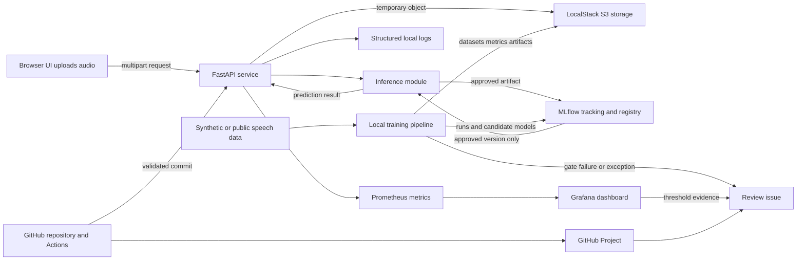
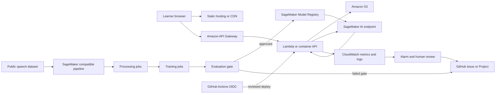
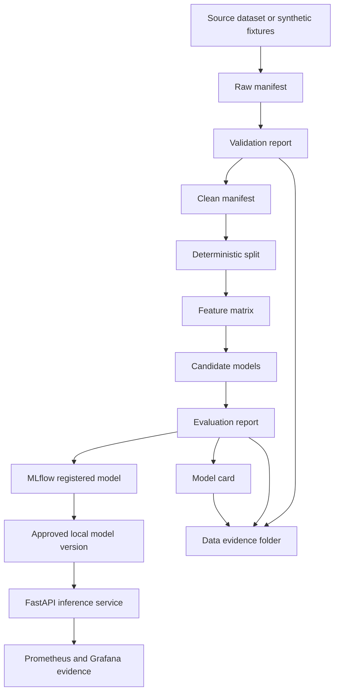
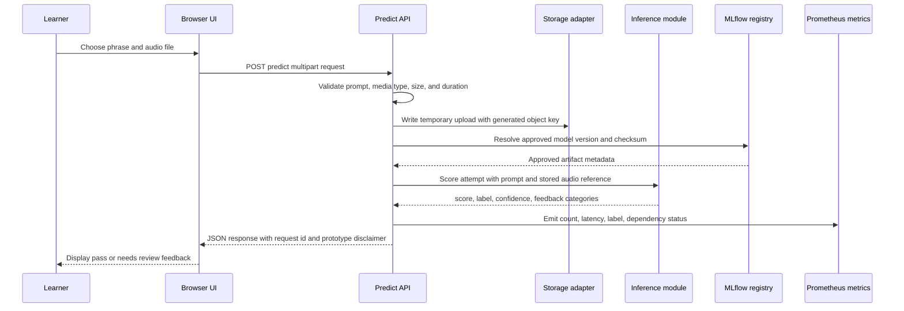
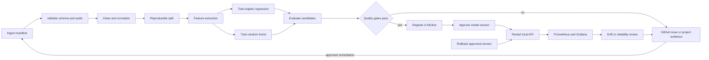
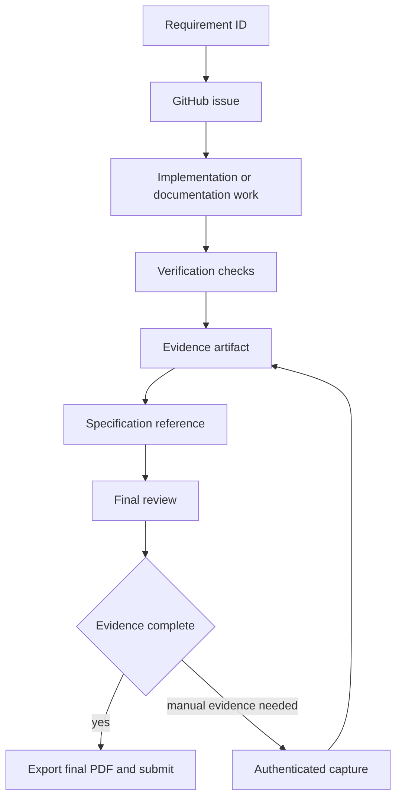

# FluentEdge

## Design and Requirements Specification

**Subtitle:** Local-first AWS-compatible MLOps prototype for AI-powered speaking feedback  
**Student / Sole CLC Team Member:** Daniel Grijalva  
**Institution:** Grand Canyon University  
**Course:** SWE-452  
**Instructor:** Ryan Woodward  
**Submission Date:** July 2026  
**Document Version:** 2.0  
**Document Status:** Sprint 2 evidence-synchronized baseline

> **Evidence status:** Local implementation evidence was verified against the repository, local Docker stack, and stored screenshots. GitHub web UI captures that require an authenticated browser session are explicitly listed as manual evidence before final submission.

---

## Table of Contents

1. [Introduction](#1-introduction)
2. [System Overview](#2-system-overview)
3. [Functional Requirements](#3-functional-requirements)
4. [Non-Functional Requirements](#4-non-functional-requirements)
5. [Data Requirements](#5-data-requirements)
6. [System Architecture](#6-system-architecture)
7. [Training and Evaluation](#7-training-and-evaluation)
8. [Deployment Requirements](#8-deployment-requirements)
9. [User Interface Requirements](#9-user-interface-requirements)
10. [Project Governance and Evidence](#10-project-governance-and-evidence)
11. [References](#11-references)
12. [Appendix A - Requirements Traceability Matrix](#appendix-a---requirements-traceability-matrix)
13. [Appendix B - Solo Responsibility and Sprint 2 Work Plan](#appendix-b---solo-responsibility-and-sprint-2-work-plan)
14. [Appendix C - Submission Checklist](#appendix-c---submission-checklist)
15. [Appendix D - Evidence Index](#appendix-d---evidence-index)

---

## Document Control

| Control item | Value |
|---|---|
| Document title | FluentEdge Design and Requirements Specification |
| Owner | Daniel Grijalva |
| Team structure | Solo CLC team |
| Related baseline | Sprint 1 Project Proposal dated June 28, 2026 |
| Project tracking | GitHub Issues and GitHub Projects, approved as the Jira replacement |
| Documentation | Repository Markdown files and GitHub evidence package; Confluence evidence requires an instructor waiver or separate attachment |
| Source control | GitHub |
| Primary implementation | Local Docker and AWS-compatible local tooling |
| Target cloud environment | Amazon Web Services |
| Approval method | Instructor review plus linked sprint evidence |

### Editing and Evidence Instructions

- Use direct links to the exact GitHub issue, GitHub Project, pull request, commit, Actions run, Confluence page or waiver, report, or stored screenshot.
- Keep screenshots in `docs/evidence/` and use relative Markdown links whenever possible.
- Keep credentials, access keys, tokens, and private user data out of the repository.
- Export this Markdown document to PDF only after links, diagrams, and evidence have been reviewed. Cursor's `Markdown PDF` extension must have `markdown-pdf.mermaidServer` set to a reachable Mermaid JavaScript file; this workspace uses `.vscode/settings.json` to load the local Mermaid bundle instead of the default CDN.
- Use APA-style author-date citations in the body and complete APA-style entries in the references section.

---

# 1. Introduction

## 1.1 Purpose

This Design and Requirements Specification defines the finalized implementation baseline for FluentEdge, an AI-powered speaking-feedback prototype with a local-first MLOps workflow designed for later deployment to AWS. The document converts the Sprint 1 concept into precise and testable requirements for data ingestion, model development, local infrastructure, AWS portability, application programming interfaces, monitoring, maintenance, and project governance.

The project will be implemented and demonstrated primarily on a local computer to control cost and complexity. AWS-compatible behavior will be represented through Docker containers, AWS SAM CLI local execution, service emulation where practical, and SageMaker-compatible local training or pipeline code. AWS documents that SAM CLI can locally test Lambda and simulate API Gateway endpoints, while SageMaker local mode can test compatible processing, training, pipeline, and inference code before managed execution (Amazon Web Services, n.d.-d, n.d.-e, n.d.-f). Managed AWS deployment remains a target architecture rather than a claim of completed cloud deployment unless actual AWS evidence is provided.

## 1.2 Audience

The primary audience is the SWE-452 instructor and project evaluator. Secondary audiences include:

- An ML engineer implementing the training and evaluation workflow.
- A software engineer implementing the API and learner interface.
- A DevOps engineer implementing local containers, infrastructure as code, and GitHub Actions.
- An operations reviewer validating monitoring, security, rollback, and cost controls.

Daniel Grijalva is the sole CLC team member and owns all technical, documentation, project-management, review, and evidence responsibilities unless an instructor, classmate, or external reviewer is explicitly documented.

## 1.3 Project Scope

FluentEdge evaluates a learner's recorded English phrase against an expected prompt and returns a structured response containing:

- A numeric score.
- A `pass` or `needs_review` label.
- A confidence value.
- Error categories or improvement guidance.
- A model version and request identifier.

The system includes public speech-data ingestion, reproducible preprocessing, feature extraction, supervised model training, automated evaluation, model versioning, controlled local deployment, an authenticated or protected REST API, a minimal learner interface, operational metrics, drift indicators, and a human-approved retraining process.

## 1.4 In Scope and Out of Scope

| In scope | Out of scope |
|---|---|
| Controlled English phrase-feedback task using public/open speech data | Full Duolingo clone or commercial mobile application |
| Data validation, preprocessing, features, classification, and feedback | Clinical, diagnostic, or disability assessment |
| Local AWS-compatible development using Docker, AWS SAM CLI, and service emulation | Guaranteed feature-for-feature replication of every managed AWS service |
| SageMaker-compatible training and pipeline code that can run locally on a small dataset | Large-scale managed training or permanent paid cloud endpoints |
| FastAPI inference service and documented REST contract | Unrestricted free-form conversation support |
| GitHub Issues, Projects, Actions, pull requests, and evidence links | Jira, because GitHub Projects was approved as its replacement |
| Monitoring, rollback, privacy, and cost controls | Enterprise certification or 24x7 production support |

## 1.5 Definitions, Acronyms, and Abbreviations

| Term | Definition |
|---|---|
| AI | Artificial intelligence; software that performs tasks commonly associated with human intelligence. |
| API | Application Programming Interface; a defined contract for software requests and responses. |
| ASR | Automatic Speech Recognition; conversion of speech audio into text. |
| AWS | Amazon Web Services; the target cloud platform. |
| CER | Character Error Rate; character-level edit distance divided by the reference character count. |
| CI/CD | Continuous Integration and Continuous Delivery/Deployment. |
| CLI | Command-Line Interface. |
| DAG | Directed Acyclic Graph; ordered pipeline steps without circular dependencies. |
| EDA | Exploratory Data Analysis. |
| F1 score | Harmonic mean of precision and recall. |
| GitHub Project | A table, board, or roadmap that tracks GitHub issues, pull requests, and custom fields (GitHub, n.d.-a). |
| IAM | Identity and Access Management. |
| Inference | Running a trained model on new input to produce a prediction. |
| JSON | JavaScript Object Notation; structured request and response format. |
| Local mode | Execution of compatible ML processing, training, pipeline, or inference code in local Docker-based environments before managed AWS execution. |
| MFCC | Mel-frequency cepstral coefficient; an acoustic speech feature. |
| ML | Machine learning. |
| MLflow | Local experiment tracking and model registry used as the prototype substitute for a managed model registry. |
| MLOps | Engineering practices for repeatable ML development, deployment, monitoring, and governance. |
| Model drift | Change in input distributions, prediction behavior, or model quality after deployment. |
| PII | Personally identifiable information. |
| REST | Representational State Transfer; an HTTP API style. |
| S3 | Amazon Simple Storage Service; object storage. Local development uses an S3-compatible endpoint where practical. |
| SAM | AWS Serverless Application Model. |
| WER | Word Error Rate; word substitutions, deletions, and insertions divided by the reference word count. |

## 1.6 Requirement Language and Priority

- **Shall** indicates a mandatory and testable requirement.
- **Should** indicates a recommended requirement that may be deferred only with a documented reason.
- **May** indicates an optional capability.
- **Must** is the highest implementation priority.
- **Should** is the second priority.
- **Could** is optional if time permits.

Requirement identifiers shall remain stable across source code, tests, GitHub Issues, GitHub Projects, pull requests, reports, and evidence.

## 1.7 Implementation Profile

FluentEdge uses two explicitly separated profiles:

1. **Local implementation profile:** The required class prototype. It uses Docker Compose, AWS SAM CLI local execution, an S3-compatible service or local object-storage adapter, a FastAPI inference container, a local ML pipeline, MLflow, and local monitoring.
2. **AWS target profile:** The deployment mapping for future cloud operation. It maps local components to Amazon S3, API Gateway, Lambda or a container service, SageMaker AI, CloudWatch, and related IAM controls.

The local profile is the minimum required implementation. The AWS target profile is not considered deployed unless cloud resources and evidence actually exist.

---

# 2. System Overview

> **Evidence E-01 - Final architecture:**  
> Evidence note: diagrams are maintained as Mermaid source in this specification, sections 2.4 and 2.5.
> Evidence README: [`docs/evidence/E-01-architecture/README.md`](docs/evidence/E-01-architecture/README.md)
> Related GitHub issue: [#1](https://github.com/DanielAndi/fluentedge/issues/1)

## 2.1 Product Vision

FluentEdge provides fast, consistent, and observable speaking feedback while demonstrating the lifecycle of an ML-enabled service. A learner supplies an expected phrase and an audio recording. The system validates the input, stores it temporarily, processes it through the approved model, returns understandable feedback, and records operational and model-quality metrics.

## 2.2 Primary Actors and Use Cases

| Actor | Primary use cases | Expected outcome |
|---|---|---|
| Learner | Select prompt, record or upload audio, request analysis, review feedback, retry | Understand whether the spoken response matches the expected phrase |
| Project owner / ML engineer | Prepare data, run pipeline, compare models, review metrics, approve model | Reproducible and traceable model version |
| Software / DevOps engineer | Build containers, run local stack, configure CI, test API, monitor service, roll back | Controlled and observable deployment |
| Instructor / reviewer | Inspect requirements, architecture, metrics, GitHub Project, evidence, risks, and deadlines | Verify completeness and implementation readiness |

## 2.3 High-Level Local Processing Flow

1. The learner selects or enters an expected phrase and records or uploads an audio file.
2. The frontend sends the audio and prompt to the local API through an HTTP endpoint.
3. The API validates file size, file type, prompt length, and request schema.
4. The API stores the audio in a temporary S3-compatible bucket or controlled local path.
5. The inference service normalizes the audio, obtains transcript and acoustic features, and loads the approved local model version.
6. The service returns a score, label, confidence, feedback categories, model version, and request ID.
7. The frontend displays the result.
8. Metrics are written to Prometheus-compatible endpoints and application logs.
9. Raw audio is deleted under the retention policy.
10. Quality, drift, or reliability breaches create a GitHub Issue for human review; retraining is not automatic.

## 2.4 Local Runtime Architecture



## 2.5 AWS Target Architecture



## 2.6 Local-to-AWS Component Mapping

| Local prototype component | AWS target equivalent | Notes |
|---|---|---|
| Docker Compose | CloudFormation, SAM, CDK, or Terraform deployment | Local compose is authoritative for the class demo |
| FastAPI container | Lambda + API Gateway, App Runner, ECS, or SageMaker-compatible container | Exact AWS hosting choice may be finalized later |
| AWS SAM CLI local API | API Gateway and Lambda | Used to test serverless request flow locally |
| LocalStack S3 or storage adapter | Amazon S3 | LocalStack is used only for supported local behaviors |
| Local Python/SageMaker-compatible pipeline | SageMaker Pipelines | Local execution uses small data and sequential steps |
| MLflow local registry | SageMaker Model Registry | Stores model versions, metrics, and approval stage locally |
| Prometheus and Grafana | CloudWatch and Model Monitor dashboards | Metrics names should remain portable |
| GitHub Actions | GitHub Actions with optional AWS OIDC deployment | No long-lived AWS keys in repository secrets |

## 2.7 Assumptions and Constraints

- The prototype targets one developer workstation and a small English dataset subset.
- Docker Desktop or Docker Engine is available.
- Local services must be startable with documented commands.
- The project must remain within a student budget.
- The task is controlled phrase comparison, not unrestricted language understanding.
- Demographic metadata may be incomplete and must not be used to overstate fairness.
- No private student recordings will be used for training.
- GitHub Projects is the approved replacement for Jira.
- Confluence remains part of the documentation evidence unless separately waived by the instructor.

---

# 3. Functional Requirements

> **Evidence E-02 - Requirements review:**  
> GitHub Project link: [FluentEdge MLOps (Project #4)](https://github.com/users/DanielAndi/projects/4)  
> Requirements issue or pull request: [#1 Finalize Sprint 2 design and requirements specification](https://github.com/DanielAndi/fluentedge/issues/1)  
> Review screenshot: `docs/evidence/E-02-requirements/requirements-review.png`

## 3.1 Data Input and Preprocessing Requirements

| ID | Priority | Requirement | Acceptance criterion |
|---|---|---|---|
| FR-DI-001 | Must | The system shall accept WAV, FLAC, MP3, or M4A input that can be decoded by the selected audio library. | Automated tests accept supported samples and reject unsupported or corrupt files. |
| FR-DI-002 | Must | The API shall reject files larger than 10 MB and audio longer than 30 seconds for the prototype. | Boundary tests return documented 4xx responses. |
| FR-DI-003 | Must | The system shall normalize training and inference audio to mono 16 kHz PCM before feature extraction. | Unit test verifies sample rate, channels, and output shape. |
| FR-DI-004 | Must | The preprocessing stage shall validate required metadata fields, missing values, duplicate clip IDs, duplicate paths, and unreadable files. | Validation report identifies each failure category. |
| FR-DI-005 | Must | Text normalization shall lowercase input, normalize whitespace, and apply documented punctuation rules. | Golden test cases match expected normalized text. |
| FR-DI-006 | Must | Train, validation, and test splits shall be reproducible and speaker-aware when speaker identifiers are available. | Repeated runs with the same seed produce identical manifests and no speaker overlap. |
| FR-DI-007 | Should | The pipeline should calculate transcript similarity, WER, CER, duration, speech rate, MFCC statistics, and signal-quality indicators. | Feature schema contains all implemented features with no invalid numeric values. |

## 3.2 ML Model Requirements

| ID | Priority | Requirement | Acceptance criterion |
|---|---|---|---|
| FR-ML-001 | Must | The baseline model shall classify attempts as `pass` or `needs_review`. | Held-out predictions use only the defined labels. |
| FR-ML-002 | Must | The training process shall log parameters, code version, dataset manifest hash, metrics, and artifact path. | MLflow run contains each required field. |
| FR-ML-003 | Must | The project shall compare at least two baseline candidates, such as logistic regression and random forest or gradient boosting. | Evaluation report contains a side-by-side comparison. |
| FR-ML-004 | Must | A candidate shall achieve macro F1 of at least 0.75 or produce a documented remediation decision. | Evaluation gate records pass or documented exception. |
| FR-ML-005 | Must | The selected model shall report precision, recall, F1, confusion matrix, WER, CER, and inference latency. | Metrics file and report contain all required values. |
| FR-ML-006 | Must | Model approval shall require human review and an explicit approved status in the local registry. | No model is marked production unless approval metadata exists. |
| FR-ML-007 | Must | The inference service shall load a versioned artifact rather than an untracked local file. | Response includes model version and artifact checksum. |
| FR-ML-008 | Should | The system should produce confidence or probability values and document calibration limitations. | Output schema includes confidence and report includes calibration note. |
| FR-ML-009 | Should | Subgroup metrics should be reported only when metadata is present and the subgroup has at least 100 test examples. | Report suppresses undersized groups. |
| FR-ML-010 | Could | An embedding-based or small neural model may be evaluated as an extension. | Optional comparison is clearly labeled as experimental. |

## 3.3 Local Infrastructure and AWS Portability Requirements

| ID | Priority | Requirement | Acceptance criterion |
|---|---|---|---|
| FR-INF-001 | Must | The complete local stack shall start with one documented command or a short documented command sequence. | A clean checkout can start all required services. |
| FR-INF-002 | Must | Docker Compose shall define the API, storage service, MLflow, Prometheus, and Grafana services used by the prototype. | `docker compose config` succeeds and services pass health checks. |
| FR-INF-003 | Must | The API shall support environment-based endpoints so local storage and future AWS S3 can use the same interface. | Tests run against a local endpoint without changing application code. |
| FR-INF-004 | Must | AWS SAM CLI shall be used to test at least one Lambda/API Gateway-compatible request path locally or the document shall record why the FastAPI container was used instead. | `sam build` and `sam local start-api` evidence or approved design decision exists. |
| FR-INF-005 | Must | The ML workflow shall run locally on a small dataset through a reproducible command. | Local pipeline produces cleaned data, model, and metrics artifacts. |
| FR-INF-006 | Must | Local artifacts shall be stored in versioned directories or object keys that include dataset and run identifiers. | No approved artifact is overwritten by a later run. |
| FR-INF-007 | Must | Infrastructure configuration shall contain no committed credentials. | Secret scan and repository inspection pass. |
| FR-INF-008 | Must | The system shall provide health checks for the API, storage dependency, model availability, MLflow, Prometheus, and Grafana. | Health-check script exits successfully when the stack is ready. |
| FR-INF-009 | Should | Infrastructure should be represented as code using Docker Compose plus AWS SAM, Terraform, or both. | Source-controlled infrastructure can recreate the local environment. |
| FR-INF-010 | Should | The same inference image should be portable to an AWS container or SageMaker-compatible deployment. | Image exposes documented health and inference routes. |
| FR-INF-011 | Should | GitHub Actions should validate Compose configuration and build the API image without requiring AWS credentials. | CI run completes on a pull request. |
| FR-INF-012 | Could | An optional AWS deployment workflow may be added behind a manual approval and environment protection rule. | No cloud deployment occurs automatically from an unreviewed branch. |

## 3.4 API, Audit, and Feedback Requirements

| ID | Priority | Requirement | Acceptance criterion |
|---|---|---|---|
| FR-API-001 | Must | `GET /health` shall return service status and dependency summaries without sensitive data. | Contract test validates status code and schema. |
| FR-API-002 | Must | `POST /predict` shall accept an expected phrase and one supported audio file or object reference. | Valid request returns a documented response. |
| FR-API-003 | Must | The prediction response shall include score, label, confidence, feedback categories, model version, request ID, and latency. | OpenAPI schema requires all fields. |
| FR-API-004 | Must | Invalid requests shall return deterministic 4xx errors with safe messages and request IDs. | Negative tests cover missing prompt, bad media, oversized file, and decode failure. |
| FR-API-005 | Must | Raw audio, access tokens, and full private transcripts shall not appear in application logs. | Automated log-redaction test passes. |
| FR-API-006 | Must | Each prediction shall emit aggregate metrics for request count, status, latency, and prediction label. | Prometheus endpoint exposes the documented metrics. |
| FR-API-007 | Should | The API should generate interactive OpenAPI documentation in local development. | `/docs` opens and matches the committed contract. |

## 3.5 GitHub Project and Collaboration Requirements

| ID | Priority | Requirement | Acceptance criterion |
|---|---|---|---|
| FR-PM-001 | Must | GitHub Issues shall represent sprint tasks with scope, acceptance criteria, owner, status, priority, requirement IDs, and evidence links. | All Sprint 2 issues contain the required fields or metadata. |
| FR-PM-002 | Must | A GitHub Project shall replace Jira and contain all active and completed project issues. | Project link opens and contains the Sprint 2 issue set. |
| FR-PM-003 | Must | The GitHub Project shall include Status, Priority, Sprint, Workstream, Requirement IDs, Target Date, and Evidence fields. | Field list or screenshot confirms each field. |
| FR-PM-004 | Must | The project workflow shall use Backlog, Ready, In Progress, In Review, Blocked, and Done states. | Board screenshot shows the states or equivalent approved configuration. |
| FR-PM-005 | Must | Issues and pull requests shall be linked to the corresponding requirements and evidence. | At least one end-to-end trace exists from requirement to issue to commit/test. |
| FR-PM-006 | Must | GitHub Actions shall provide coding evidence for tests, linting, and build validation. | Workflow run links are present in the evidence index. |
| FR-PM-007 | Should | Repository labels and milestones should identify workstream, priority, sprint, and risk. | Labels and milestones are visible in GitHub. |
| FR-PM-008 | Should | Issue templates should require acceptance criteria and evidence before closure. | Template files exist and a sample issue uses them. |
| FR-PM-009 | Should | The setup shall be reproducible through a documented GitHub CLI script. | Script is idempotent or safely detects existing resources. |
| FR-PM-010 | Could | Automated Project field updates may be implemented with GitHub Actions or GraphQL after the baseline board is complete. | Automation is documented and does not expose tokens. |

---

# 4. Non-Functional Requirements

> **Evidence E-03 - Non-functional verification:**  
> Test report: [CI run 28911390804](https://github.com/DanielAndi/fluentedge/actions/runs/28911390804) (JUnit/coverage artifacts)
> Security scan: [CI run 28911390804](https://github.com/DanielAndi/fluentedge/actions/runs/28911390804) (gitleaks + pip-audit)
> Performance screenshot: `docs/evidence/E-03-non-functional/performance.png`

| ID | Category | Requirement | Measurement |
|---|---|---|---|
| NFR-PERF-001 | Performance | Local `/predict` p95 latency shall be no more than 2.0 seconds for a 10-second prototype clip after warm-up. | At least 30 measured requests. |
| NFR-PERF-002 | Performance | `GET /health` p95 latency shall be below 250 ms locally. | Automated performance test. |
| NFR-REL-001 | Reliability | The API shall return a controlled error instead of crashing when a dependency is unavailable. | Forced dependency-failure test. |
| NFR-REL-002 | Reliability | The last approved model artifact shall remain available as the rollback target. | Rollback test loads the previous version. |
| NFR-REL-003 | Reliability | Local stack startup shall succeed on two consecutive clean runs. | Startup logs and health-check output. |
| NFR-SCALE-001 | Scalability | The API shall support at least five concurrent local requests without data corruption. | Concurrency test passes. |
| NFR-SEC-001 | Security | Secrets shall be loaded from environment variables or approved secret stores and never committed. | Secret scanner and repository review. |
| NFR-SEC-002 | Security | Uploaded filenames shall be replaced with generated object keys and shall not control filesystem paths. | Path-traversal test passes. |
| NFR-SEC-003 | Security | Dependencies shall be pinned or bounded and scanned for known vulnerabilities. | Dependency scan attached. |
| NFR-PRIV-001 | Privacy | Raw uploaded audio shall be deleted within 24 hours by default and sooner after successful inference when configured. | Cleanup test and configuration evidence. |
| NFR-PRIV-002 | Privacy | Logs shall exclude raw audio, access tokens, and full user transcripts. | Log-redaction test. |
| NFR-OBS-001 | Observability | Metrics shall include request count, error count, p50/p95 latency, prediction distribution, confidence summary, and active model version. | Dashboard and metric endpoint evidence. |
| NFR-OBS-002 | Observability | Every request shall have a correlation/request ID. | API and log sample. |
| NFR-PORT-001 | Portability | The API and inference service shall run from the same Docker image in local and AWS-targeted configurations. | Local container smoke test. |
| NFR-MAINT-001 | Maintainability | Source code shall pass formatting, linting, type checks where configured, and unit tests in CI. | GitHub Actions run. |
| NFR-MAINT-002 | Maintainability | Public functions and configuration files shall include clear documentation and examples. | Code review checklist. |
| NFR-USAB-001 | Usability | Learner feedback shall use plain language and shall not claim clinical pronunciation accuracy. | UI review against approved wording. |
| NFR-COST-001 | Cost | The required local demonstration shall not require paid AWS resources. | Local demo completes with no cloud resources. |
| NFR-COST-002 | Cost | Any optional AWS resources shall have documented shutdown and deletion steps. | Operations checklist. |

## 4.1 Reliability and Recovery Rules

- A failed model candidate shall not replace the approved model.
- A failed deployment shall not delete the currently serving model artifact.
- Training and monitoring artifacts shall use immutable versioned paths.
- Local services shall use named volumes or documented artifact directories.
- The operations checklist shall define startup, health verification, evidence capture, shutdown, and cleanup.

## 4.2 Security Threat Considerations

| Threat | Required control |
|---|---|
| Malicious or oversized upload | Media-type validation, size limit, duration limit, decode validation |
| Path traversal | Generated object keys, no direct use of client filenames |
| Secret leakage | `.env.example`, ignored `.env`, GitHub secret scanning, no credentials in logs |
| Unsafe model artifact | Checksum, version metadata, controlled model directory, approval state |
| Dependency vulnerability | Automated dependency and container scans |
| Abuse of cloud deployment | Manual approval, environment protection, least-privilege role, cost alarm |
| Sensitive telemetry | Metric allow-list and transcript/audio exclusion |

---

# 5. Data Requirements

> **Evidence E-04 - Data evidence:**  
> Dataset card: [`docs/data/dataset_card.md`](https://github.com/DanielAndi/fluentedge/blob/db1a67cd68efb402386870d66422a4a9617c61ed/docs/data/dataset_card.md)  
> Validation report: [`artifacts/runs/467fb3aa/evaluation_report.json`](artifacts/runs/467fb3aa/evaluation_report.json) (local pipeline output)  
> Schema file: [`ml/data/schema.py`](https://github.com/DanielAndi/fluentedge/blob/db1a67cd68efb402386870d66422a4a9617c61ed/ml/data/schema.py)  
> EDA screenshot: `docs/evidence/E-04-data/eda-screenshot.png`

## 5.1 Data Sources and Licensing

The prototype will use a limited English subset of Mozilla Common Voice or another instructor-approved public speech dataset. Mozilla Common Voice provides downloadable speech datasets and release information through its dataset catalog (Mozilla Foundation, n.d.). The dataset card shall record:

- Dataset release name and version.
- Download date.
- License and attribution requirements.
- Source URL.
- Selected locale and files.
- Sample counts and total duration.
- Known limitations.
- Checksums or manifest hashes.

No private student voice recordings will be collected for model training during the class prototype.

## 5.2 Expected Dataset Envelope

| Item | Prototype target |
|---|---|
| Raw audio clips | Approximately 2,000 to 10,000 selected clips |
| Total audio duration | Approximately 3 to 20 hours |
| Raw storage | Approximately 1 to 10 GB |
| Cleaned metadata | Less than 500 MB |
| Feature matrix | Less than 2 GB |
| Candidate models and reports | Less than 2 GB |
| Train/validation/test split | 70/15/15 or 80/10/10, documented and reproducible |

## 5.3 Canonical Data Schema

| Field | Type | Required | Description |
|---|---|---|---|
| `clip_id` | string | Yes | Unique clip identifier |
| `audio_uri` | string | Yes | S3-compatible URI or controlled local path |
| `transcript` | string | Yes | Expected or reference text |
| `normalized_transcript` | string | Yes | Output of text normalization |
| `split` | enum | Yes | `train`, `validation`, or `test` |
| `label` | enum | Yes | `pass` or `needs_review` |
| `duration_seconds` | float | Yes | Decoded audio duration |
| `sample_rate_hz` | integer | Yes | Original or normalized sample rate |
| `speaker_id` | string | No | Speaker grouping identifier when available |
| `locale` | string | No | Locale metadata when available |
| `accent` | string | No | Self-reported accent metadata when available |
| `source_release` | string | Yes | Dataset release identifier |
| `source_status` | string | No | Source validation status; not used as a model feature |
| `manifest_version` | string | Yes | Dataset manifest version |

## 5.4 Labeling and Annotation Requirements

1. Positive examples shall originate from validated clips that decode successfully and satisfy minimum quality rules.
2. Negative examples may originate from invalidated clips, controlled prompt mismatch, or documented acoustic degradation.
3. Source validation fields shall not be used as model features because doing so could create leakage.
4. Synthetic transformations shall be limited to the training split unless a separate robustness set is explicitly created.
5. Every derived label shall include a documented rule and provenance field.
6. Human review shall be required before claiming that a label represents pronunciation quality.

## 5.5 Preprocessing Rules

- Decode and verify the audio file.
- Convert to mono 16 kHz PCM.
- Reject clips outside the configured duration bounds.
- Normalize text consistently.
- Detect missing values and duplicates.
- Preserve speaker separation between splits when possible.
- Save preprocessing parameters with the dataset manifest.
- Produce deterministic outputs using a recorded seed.

## 5.6 Storage, Privacy, and Retention

| Data type | Local storage | Retention | Protection |
|---|---|---|---|
| Public raw dataset | LocalStack S3 bucket or controlled data directory | Through course unless license requires otherwise | Not committed to Git; checksum and manifest only |
| Cleaned dataset | Versioned artifact directory or bucket prefix | Through course | Restricted local path; no public upload |
| Model artifacts | MLflow artifact directory or S3-compatible bucket | Through course plus rollback versions | Checksum and approval metadata |
| User-uploaded demo audio | Temporary bucket/prefix | Maximum 24 hours by default | Generated key, no public access, cleanup job |
| Metrics and logs | Local volumes | 30 to 90 days for prototype evidence | No raw audio, tokens, or full transcripts |
| Evidence screenshots | `docs/evidence/` | Through final grading | Review for secrets before commit |

## 5.7 Data and Artifact Lineage



---

# 6. System Architecture

> **Evidence E-05 - Architecture implementation:**  
> Compose file: [`infrastructure/compose.yaml`](https://github.com/DanielAndi/fluentedge/blob/db1a67cd68efb402386870d66422a4a9617c61ed/infrastructure/compose.yaml)  
> SAM or IaC file: [`infrastructure/sam/template.yaml`](https://github.com/DanielAndi/fluentedge/blob/db1a67cd68efb402386870d66422a4a9617c61ed/infrastructure/sam/template.yaml)  
> Health-check output: `docs/evidence/E-05-infrastructure/health-check-output.png`

## 6.1 Component Breakdown

| Component | Local responsibility | AWS target mapping |
|---|---|---|
| Learner UI | Record/upload audio and display feedback | Static web hosting or web application |
| FastAPI service | Validate requests, coordinate storage and inference, return response | Lambda/API Gateway, App Runner, ECS, or similar |
| Storage adapter | Store temporary audio and artifacts | Amazon S3 |
| LocalStack | Emulate selected AWS APIs locally where practical | Actual AWS services |
| AWS SAM CLI | Emulate Lambda and API Gateway request flow | API Gateway and Lambda |
| Training pipeline | Validate, preprocess, train, evaluate, and package model | SageMaker Pipelines or managed jobs |
| MLflow | Experiments, artifacts, model versions, approval stage | SageMaker Model Registry or equivalent |
| Prometheus | Collect application and model metrics | CloudWatch custom metrics |
| Grafana | Visualize local metrics | CloudWatch dashboard or managed Grafana |
| GitHub Actions | Test, lint, scan, build, and package | Same service, with optional AWS deployment |
| GitHub Issues and Projects | Sprint planning, work status, risks, and evidence | Same service; approved Jira replacement |

## 6.2 Communication and Data Flow

| Step | Source to destination | Protocol or interface | Data |
|---|---|---|---|
| 1 | Browser to API | HTTP multipart/form-data or JSON + object reference | Audio and expected phrase |
| 2 | API to storage | S3-compatible SDK or storage adapter | Temporary audio object |
| 3 | API to inference module | Internal Python call or HTTP container call | Object key, prompt, request metadata |
| 4 | Inference module to registry | MLflow client or artifact loader | Approved model metadata and artifact |
| 5 | Inference module to API | Python object or JSON | Score, label, confidence, feedback |
| 6 | API to browser | JSON | User-visible result and request ID |
| 7 | API to Prometheus | `/metrics` scrape | Aggregate operational metrics |
| 8 | Training pipeline to storage | Filesystem or S3-compatible SDK | Datasets, features, models, reports |
| 9 | Training pipeline to MLflow | MLflow tracking API | Parameters, metrics, artifacts, model version |
| 10 | CI to repository | GitHub Actions | Test, scan, build, and evidence output |

### 6.2.1 Prediction Request Sequence



## 6.3 Repository Structure

```text
fluentedge/
├── .github/
│   ├── ISSUE_TEMPLATE/
│   ├── PULL_REQUEST_TEMPLATE.md
│   └── workflows/
├── api/
│   ├── Dockerfile
│   └── app/
├── data/
│   └── README.md
├── docs/
│   ├── evidence/
│   ├── architecture/
│   └── design/
├── infrastructure/
│   ├── compose.yaml
│   ├── localstack/
│   ├── sam/
│   └── terraform/
├── ml/
│   ├── data/
│   ├── features/
│   ├── models/
│   ├── pipeline/
│   └── evaluation/
├── monitoring/
│   ├── prometheus/
│   └── grafana/
├── scripts/
├── tests/
├── .env.example
├── Makefile
├── pyproject.toml
└── README.md
```

## 6.4 Environment Profiles

| Environment | Purpose | Data | Deployment |
|---|---|---|---|
| Local development | Fast iteration and unit tests | Tiny fixture set | Direct Python or partial Compose |
| Local integration | Full prototype demonstration | Small public dataset subset | Docker Compose + SAM local where applicable |
| CI | Automated validation | Synthetic fixtures only | GitHub-hosted runner |
| Optional AWS demo | Short instructor demonstration | Minimal approved dataset | Manual workflow with shutdown checklist |

## 6.5 Architecture Decisions

| Decision | Selected approach | Reason | Rejected alternative |
|---|---|---|---|
| Jira replacement | GitHub Projects and Issues | Instructor approved; integrates directly with code and evidence | Maintaining duplicate Jira and GitHub boards |
| Required deployment | Local-first | Avoids cost and account barriers while supporting a working prototype | Permanent paid cloud endpoint |
| API | FastAPI | Typed schema, OpenAPI docs, testability, container portability | Custom untyped HTTP server |
| Serverless compatibility | AWS SAM CLI local | Simulates Lambda/API Gateway request flow locally | Cloud-only testing |
| Object storage | S3-compatible adapter | Preserves AWS portability | Hard-coded local filesystem only |
| Model registry | MLflow locally | Provides versioning, metrics, and approval stages | Untracked model files |
| Monitoring | Prometheus and Grafana | Works locally and supports measurable evidence | Logs only |
| Managed ML target | SageMaker-compatible pipeline design | Preserves AWS architecture without requiring paid jobs | Notebook-only manual workflow |

---

# 7. Training and Evaluation

> **Evidence E-06 - Training and evaluation:**  
> Pipeline run: [`docs/evidence/E-06-training-evaluation/README.md`](docs/evidence/E-06-training-evaluation/README.md)  
> Metrics report: [`artifacts/runs/467fb3aa/evaluation_report.json`](artifacts/runs/467fb3aa/evaluation_report.json)  
> Model card: [`artifacts/runs/467fb3aa/model_card.md`](artifacts/runs/467fb3aa/model_card.md)  
> MLflow screenshot: `docs/evidence/E-06-training-evaluation/mlflow-screenshot.png`
> Current recapture note: local pipeline recapture also produced `artifacts/runs/0723e041/` and MLflow model version 4; the API health evidence still shows approved serving version 1 from `.env`.

## 7.1 Training Pipeline Steps



| Stage | Input | Output | Quality gate |
|---|---|---|---|
| Ingest | Public audio and metadata | Raw manifest | Required source files available |
| Validate | Raw manifest | Validation report | No unhandled schema or decode errors |
| Clean | Valid rows | Clean manifest and audio references | Missing/duplicate/invalid rows handled |
| Split | Clean manifest | Train/validation/test manifests | Reproducible and leakage checks pass |
| Features | Clean audio and text | Feature matrix | No invalid numeric values; schema hash stored |
| Train | Training features | Candidate models | Parameters and artifacts logged |
| Evaluate | Candidate and test set | Metrics and model card | Thresholds met or exception documented |
| Register | Approved candidate | Versioned MLflow model | Artifact checksum and approval stage recorded |
| Deploy | Approved model | Running local inference service | Smoke and contract tests pass |
| Monitor | Requests and outputs | Dashboard and alerts | Threshold breach creates review work item |

## 7.2 Baseline Model Strategy

The initial model will use interpretable supervised classifiers. The minimum comparison is:

- Logistic regression.
- Random forest or gradient boosting.

Features may include:

- Transcript similarity.
- WER and CER.
- Audio duration.
- Estimated speech rate.
- MFCC mean and standard deviation.
- RMS energy and silence ratio.
- Signal-quality indicators.
- ASR confidence proxy when available.

A neural or embedding-based model is optional and shall not replace the interpretable baseline without a documented comparison.

## 7.3 Evaluation Metrics

| Metric | Purpose | Minimum decision rule |
|---|---|---|
| Macro F1 | Balanced classification quality | At least 0.75 or documented remediation |
| Precision | False-acceptance analysis | Report by class |
| Recall | False-rejection analysis | Report by class |
| Confusion matrix | Error distribution | Required for every candidate |
| WER | Word-level speech/text mismatch | Report mean, median, and percentiles |
| CER | Character-level mismatch | Report mean, median, and percentiles |
| p50/p95 inference latency | Operational responsiveness | p95 no more than 2 seconds locally after warm-up |
| Subgroup performance | Fairness risk review | Report only for adequate sample counts |
| Calibration or confidence distribution | Confidence interpretation | Document limitations even if no formal calibration is used |

## 7.4 Model Approval Gates

A model may be marked approved only when:

1. Data validation completes without unresolved critical errors.
2. Split leakage checks pass.
3. Macro F1 meets the threshold or an instructor-reviewed exception is documented.
4. Performance and API smoke tests pass.
5. Model card, dataset version, code commit, metrics, and checksum are recorded.
6. No critical subgroup or privacy risk is unresolved.
7. Daniel Grijalva records the approval decision in MLflow and the linked GitHub Issue.

## 7.5 Testing Plan

| Test type | Examples | Evidence |
|---|---|---|
| Unit | Text normalization, audio decode, feature functions, scoring, schemas | Pytest output and Actions run |
| Data | Schema, missing values, duplicates, duration, split leakage | Validation report |
| Model | Thresholds, confusion matrix, regression comparison | Evaluation report and model card |
| API | `/health`, `/predict`, invalid media, oversized input, response schema | Integration test output |
| Infrastructure | Compose validation, service health, storage access, SAM build | Startup and health-check logs |
| Performance | p50/p95 latency and concurrency | Performance table and dashboard |
| Security | Secret scan, dependency scan, path traversal, log redaction | Scan reports |
| Regression | New candidate compared with approved model | Approval issue and MLflow comparison |

## 7.6 Reproducibility Requirements

Each model run shall record:

- Git commit SHA.
- Dataset manifest version and hash.
- Random seed.
- Dependency lock or environment version.
- Feature schema version.
- Hyperparameters.
- Metrics.
- Model artifact checksum.
- Start and completion timestamps.
- Approval state.

---

# 8. Deployment Requirements

> **Evidence E-07 - Deployment and monitoring:**  
> Compose startup evidence: `docs/evidence/E-05-infrastructure/health-check-output.png`  
> CI run: [CI run 28911390804](https://github.com/DanielAndi/fluentedge/actions/runs/28911390804)  
> Dashboard: `docs/evidence/E-07-deployment-monitoring/grafana-dashboard.png`  
> Rollback test: [`docs/evidence/E-07-deployment-monitoring/rollback-test.md`](docs/evidence/E-07-deployment-monitoring/rollback-test.md)

## 8.1 Local Environment Setup

The local development prerequisites are:

- Git.
- GitHub CLI.
- Docker Desktop or Docker Engine with Compose.
- Python 3.11 or instructor-approved version.
- AWS CLI for compatible local commands.
- AWS SAM CLI if the serverless adapter is implemented.
- `make` or documented equivalent commands.

The repository shall include:

- `.env.example` with safe example values.
- `Makefile` or task runner.
- Compose file.
- Health-check script.
- Seed/bootstrap script for local storage and monitoring.
- Setup and teardown instructions.

## 8.2 Deployment Strategy

The required deployment is a local real-time API. The system will use:

- A Dockerized FastAPI service.
- A versioned approved model artifact.
- An S3-compatible storage adapter.
- Local monitoring.
- Optional AWS SAM local execution for Lambda/API Gateway-compatible paths.

Batch scoring may be added for evaluation datasets, but the learner interaction uses real-time inference.

## 8.3 CI/CD Pipeline

| Trigger | Required actions | Release decision |
|---|---|---|
| Pull request | Format, lint, type check, unit tests, data fixture tests, API tests, secret scan, dependency scan, Compose validation | Must pass before merge |
| Merge to main | Repeat tests, build container, generate artifact metadata | Main remains deployable |
| Version tag | Build versioned image, publish release notes or local artifact package | Manual owner review |
| Manual workflow dispatch | Optional AWS deployment or local demonstration build | Protected approval required |
| Model candidate registration | Run evaluation and regression comparison | Human approval required |

## 8.4 GitHub Actions Requirements

The workflow shall:

- Use pinned action major versions and reviewed third-party actions.
- Avoid long-lived AWS access keys.
- Use minimum permissions.
- Cache dependencies safely.
- Upload test and scan reports as artifacts.
- Fail on test failures and critical secret findings.
- Build the inference image.
- Avoid starting paid cloud resources by default.

## 8.5 Monitoring and Maintenance

| Signal | Threshold or review rule | Response |
|---|---|---|
| API 5xx rate | Greater than 5% for 5 minutes | Open or update incident issue; inspect logs; roll back if release-related |
| p95 latency | Greater than 2 seconds locally for 10 minutes | Profile preprocessing and model; document result |
| Health check | Two consecutive failures | Restart service; verify dependencies; capture evidence |
| Prediction distribution | Significant shift from baseline | Create drift review issue |
| Confidence distribution | Sustained decrease or abnormal concentration | Review data and calibration |
| Model version mismatch | API version differs from approved registry version | Stop demo and restore approved artifact |
| Storage growth | Exceeds configured local threshold | Run cleanup and verify retention policy |
| Optional AWS cost | Forecast exceeds configured student limit | Stop/delete resources and return to local mode |

## 8.6 Rollback Plan

1. Identify the last approved model version in MLflow.
2. Update the `APPROVED_MODEL_URI` environment variable or model alias.
3. Restart only the API/inference service.
4. Run `/health` and a known prediction smoke test.
5. Record the rollback in a GitHub Issue.
6. Attach logs, model versions, reason, and outcome.

## 8.7 Shutdown and Cleanup

The repository shall document commands that:

- Stop containers.
- Remove temporary containers without deleting required evidence.
- Delete expired uploaded audio.
- Preserve approved model and report volumes.
- Delete optional AWS resources if they were created.
- Confirm no paid endpoint remains running.

---

# 9. User Interface Requirements

> **Evidence E-08 - UI and API:**  
> Learner UI screenshot: `docs/evidence/E-08-ui-api/ui-screenshot.png`  
> OpenAPI link: [`docs/evidence/E-08-ui-api/openapi.json`](docs/evidence/E-08-ui-api/openapi.json)  
> Dashboard screenshot: `docs/evidence/E-07-deployment-monitoring/grafana-dashboard.png`  
> Sample API response: [`docs/evidence/E-08-ui-api/sample_response.json`](docs/evidence/E-08-ui-api/sample_response.json)

## 9.1 Learner Interface

The learner interface shall provide:

- Expected phrase display or text entry.
- Record or file-upload control.
- Supported-format and size guidance.
- Submit/analyze button.
- Progress/loading state.
- Score and pass/needs-review result.
- Confidence value with plain-language explanation.
- Error categories or improvement guidance.
- Retry control.
- Request ID for troubleshooting.

## 9.2 Operations Dashboard

The local Grafana dashboard shall display:

- Request count.
- Successful and failed requests.
- p50 and p95 latency.
- Prediction label distribution.
- Average confidence.
- Active model version.
- Dependency health.
- Storage or cleanup status where practical.

## 9.3 Accessibility and Usability

- Controls shall have labels.
- Keyboard navigation shall be supported.
- Errors shall not be communicated by color alone.
- Text shall be readable at common zoom levels.
- Feedback shall avoid clinical or absolute claims.
- The interface shall explain that results are prototype estimates.

## 9.4 API Contract Example

### Request

```http
POST /predict
Content-Type: multipart/form-data

expected_phrase=The quick brown fox jumps over the lazy dog
file=@attempt.wav
```

### Response

```json
{
  "request_id": "req_01J...",
  "score": 87.4,
  "label": "pass",
  "confidence": 0.91,
  "feedback_categories": [
    "minor_word_timing_difference"
  ],
  "model_version": "fluentedge-baseline-3",
  "latency_ms": 642
}
```

### Error Response

```json
{
  "request_id": "req_01J...",
  "error": {
    "code": "UNSUPPORTED_AUDIO_TYPE",
    "message": "Upload a WAV, FLAC, MP3, or M4A file."
  }
}
```

---

# 10. Project Governance and Evidence

> **Evidence E-09 - GitHub governance:**  
> Repository: [DanielAndi/fluentedge](https://github.com/DanielAndi/fluentedge)  
> GitHub Project: [FluentEdge MLOps #4](https://github.com/users/DanielAndi/projects/4)  
> Sprint milestone: [Sprint 2 - Design and Local Baseline](https://github.com/DanielAndi/fluentedge/milestone/1)  
> Confluence space/page: GitHub repository and Project evidence are used in place of Confluence only if the instructor waiver is attached or confirmed in writing.

## 10.1 GitHub Project Configuration

The GitHub Project replaces Jira and shall use the following configuration. GitHub describes Projects as flexible table, board, and roadmap views integrated with issues and pull requests, with customizable fields and synchronized work metadata (GitHub, n.d.-a, n.d.-b).

### Required Status Values

- Backlog
- Ready
- In Progress
- In Review
- Blocked
- Done

### Required Custom Fields

| Field | Type | Values or format |
|---|---|---|
| Priority | Single select | P0, P1, P2, P3 |
| Sprint | Single select | Sprint 1, Sprint 2, Sprint 3, Sprint 4, Final |
| Workstream | Single select | Documentation, Data, ML, API, Infrastructure, Testing, Monitoring, UI |
| Requirement IDs | Text | Example: `FR-INF-001, NFR-PORT-001` |
| Target Date | Date | ISO date |
| Evidence | Text | Direct link or relative evidence path |
| Risk | Single select | Low, Medium, High |

### Recommended Views

- **Sprint Board:** Board grouped by Status and filtered to the current sprint.
- **Requirements Table:** Table showing issue, Status, Priority, Workstream, Requirement IDs, Target Date, and Evidence.
- **Roadmap:** Date-based view for major milestones.
- **Blocked Work:** Filtered table where Status is Blocked.
- **Evidence Review:** Filtered table where Evidence is empty or Status is In Review.

GitHub CLI supports creating projects, fields, issues, and project items, and the CLI requires the `project` token scope for project operations (GitHub, n.d.-c, n.d.-d). Saved view layout and some automation settings may still require the GitHub web interface; any manual step shall be listed in the generated setup report.

## 10.2 Issue Completion Standard

An issue may be closed only when:

- The acceptance criteria are satisfied.
- Required tests pass.
- Relevant requirement IDs are listed.
- Code or documentation is merged or committed.
- Evidence links are attached.
- The GitHub Project Status is Done.
- Remaining risks or follow-up issues are documented.

## 10.3 Evidence Storage Standard

Use the following naming convention:

```text
docs/evidence/
├── E-01-architecture/
├── E-02-requirements/
├── E-03-non-functional/
├── E-04-data/
├── E-05-infrastructure/
├── E-06-training-evaluation/
├── E-07-deployment-monitoring/
├── E-08-ui-api/
├── E-09-github-governance/
└── E-10-final-review/
```

Screenshots shall include a short Markdown caption with:

- Date captured.
- What the image proves.
- Related issue or requirement.
- Any limitation.

### 10.3.1 Evidence Review Workflow



## 10.4 Documentation Responsibilities

| Artifact | Owner | Minimum evidence |
|---|---|---|
| GitHub repository | Daniel Grijalva | README, source, tests, workflows, commits, pull requests |
| GitHub Project | Daniel Grijalva | Fields, issues, statuses, deadlines, evidence links |
| Confluence or approved replacement | Daniel Grijalva | Architecture, decisions, risk log, sprint notes |
| Design specification | Daniel Grijalva | This Markdown file and exported PDF |
| Coding evidence | Daniel Grijalva | Commit SHA, test output, Actions run, container build |
| Challenge log | Daniel Grijalva | Issue comments, decisions, mitigation, follow-up |
| Deadlines | Daniel Grijalva | Milestones, target dates, project roadmap |

---

# 11. References

Amazon Web Services. (n.d.-a). *Amazon SageMaker AI metrics in Amazon CloudWatch*. Amazon SageMaker AI Developer Guide. Retrieved July 6, 2026, from https://docs.aws.amazon.com/sagemaker/latest/dg/monitoring-cloudwatch.html

Amazon Web Services. (n.d.-b). *Amazon SageMaker Model Monitor*. Amazon SageMaker AI Developer Guide. Retrieved July 6, 2026, from https://docs.aws.amazon.com/sagemaker/latest/dg/model-monitor.html

Amazon Web Services. (n.d.-c). *Implement MLOps*. Amazon SageMaker AI Developer Guide. Retrieved July 6, 2026, from https://docs.aws.amazon.com/sagemaker/latest/dg/mlops.html

Amazon Web Services. (n.d.-d). *Local mode support in Amazon SageMaker Studio*. Amazon SageMaker AI Developer Guide. Retrieved July 6, 2026, from https://docs.aws.amazon.com/sagemaker/latest/dg/studio-updated-local.html

Amazon Web Services. (n.d.-e). *Run pipelines using local mode*. Amazon SageMaker AI Developer Guide. Retrieved July 6, 2026, from https://docs.aws.amazon.com/sagemaker/latest/dg/pipelines-local-mode.html

Amazon Web Services. (n.d.-f). *What is the AWS Serverless Application Model (AWS SAM)?* AWS Serverless Application Model Developer Guide. Retrieved July 6, 2026, from https://docs.aws.amazon.com/serverless-application-model/latest/developerguide/what-is-sam.html

Amazon Web Services. (n.d.-g). *sam local start-api*. AWS Serverless Application Model Developer Guide. Retrieved July 6, 2026, from https://docs.aws.amazon.com/serverless-application-model/latest/developerguide/sam-cli-command-reference-sam-local-start-api.html

GitHub. (n.d.-a). *About Projects*. GitHub Docs. Retrieved July 6, 2026, from https://docs.github.com/en/issues/planning-and-tracking-with-projects/learning-about-projects/about-projects

GitHub. (n.d.-b). *Planning and tracking with Projects*. GitHub Docs. Retrieved July 6, 2026, from https://docs.github.com/en/issues/planning-and-tracking-with-projects

GitHub. (n.d.-c). *gh project*. GitHub CLI Manual. Retrieved July 6, 2026, from https://cli.github.com/manual/gh_project

GitHub. (n.d.-d). *gh issue create*. GitHub CLI Manual. Retrieved July 6, 2026, from https://cli.github.com/manual/gh_issue_create

Mozilla Foundation. (n.d.). *Common Voice datasets*. Common Voice. Retrieved July 6, 2026, from https://commonvoice.mozilla.org/en/datasets

---

# Appendix A - Requirements Traceability Matrix

> **Evidence E-10 - Final traceability review:**  
> Review issue or pull request: [#9 Synchronize Sprint 2 evidence](https://github.com/DanielAndi/fluentedge/issues/9)  
> Traceability screenshot/report: [`docs/evidence/E-10-final-review/SPRINT2_FINAL_SUBMISSION.md`](docs/evidence/E-10-final-review/SPRINT2_FINAL_SUBMISSION.md)

| Requirement group | Implementation location | Verification | Required evidence |
|---|---|---|---|
| FR-DI-* | `ml/data`, `ml/features`, storage adapter | Unit and data validation tests | Validation report and test run |
| FR-ML-* | `ml/models`, `ml/evaluation`, MLflow | Model and regression tests | Metrics, model card, MLflow version |
| FR-INF-* | `infrastructure`, Compose, SAM, scripts | Config validation, startup, health checks | Compose/SAM files and startup evidence |
| FR-API-* | `api`, OpenAPI, tests | Contract and negative tests | API test report and sample response |
| FR-PM-* | GitHub Issues, Project, Actions | Project audit and evidence review | Project link, issue links, Actions runs |
| NFR-PERF-* | API and inference | Load and latency tests | p50/p95 report and dashboard |
| NFR-REL-* | Deployment and model registry | Failure and rollback tests | Failure evidence and rollback issue |
| NFR-SEC-* | Configuration, CI, API | Secret, dependency, and security tests | Scan reports |
| NFR-PRIV-* | Logging and cleanup | Redaction and retention tests | Log sample and cleanup output |
| NFR-OBS-* | Prometheus and Grafana | Metrics completeness and alert review | Dashboard screenshot |
| NFR-PORT-* | Docker and adapters | Local container smoke test | Image build and smoke-test output |
| NFR-MAINT-* | Repository and Actions | Lint, type, test, documentation review | CI run |
| NFR-USAB-* | UI | Accessibility and wording review | UI screenshot and checklist |
| NFR-COST-* | Local deployment and optional AWS | Cost and cleanup review | Local-only evidence or AWS deletion proof |

---

# Appendix B - Solo Responsibility and Sprint 2 Work Plan

## B.1 Solo Ownership

Daniel Grijalva is the sole team member and therefore owns planning, analysis, architecture, implementation, testing, documentation, deployment, monitoring, and final evidence. GitHub assignee fields shall use Daniel's GitHub account or `@me` when scripts run under his authenticated account.

## B.2 Sprint 2 GitHub Issues

| Suggested title | Purpose | Completion evidence |
|---|---|---|
| Finalize Sprint 2 design and requirements specification | Complete and review this document | Markdown commit, PDF export, review issue |
| Define data contract and validation rules | Implement schema and validation baseline | Schema, tests, validation output |
| Build local AWS-compatible infrastructure | Compose, SAM, storage, health checks | Startup logs and infrastructure files |
| Create training pipeline skeleton | Local ingest-to-evaluation pipeline | Pipeline run and artifacts |
| Create FastAPI service and API contract | `/health`, `/predict`, errors, OpenAPI | API tests and sample response |
| Configure GitHub repository and CI | Labels, templates, workflows, branch protection plan | Repository settings and Actions run |
| Configure GitHub Project as Jira replacement | Fields, views, issues, milestones, statuses | Project screenshot and link |
| Create monitoring and rollback baseline | Prometheus, Grafana, model rollback | Dashboard and rollback test |
| Synchronize Sprint 2 evidence | Link issues, commits, reports, and screenshots | Completed Appendix D |

## B.3 Challenges and Mitigations

| Challenge | Mitigation |
|---|---|
| Public dataset labels do not equal professional pronunciation grades | Limit claims to phrase similarity and pass/needs-review; document limitations |
| Accent and locale metadata may be incomplete | Report subgroup metrics only when sample size is adequate |
| Managed AWS services are costly or unavailable | Use local mode, AWS SAM CLI, Docker, and service adapters; treat AWS as target architecture |
| Local emulators do not perfectly reproduce AWS | Document unsupported behavior and preserve portable interfaces |
| Solo-team evidence burden | Use stable requirement IDs and automate GitHub setup and evidence indexing |
| Large audio payloads | Enforce strict size/duration limits and temporary storage |
| Model drift or poor behavior | Use metrics, review thresholds, GitHub Issues, and human-approved retraining |

## B.4 Current and Future Deadlines

| Milestone | Expected output | Evidence |
|---|---|---|
| Sprint 2 | Final specification, repository baseline, GitHub Project, local infrastructure skeleton | Links and screenshots |
| Sprint 3 | Dataset card, validation, EDA, features, baseline models, evaluation | Reports and pipeline runs |
| Sprint 4 | Local real-time API, CI/CD, monitoring, rollback | Demo and Actions evidence |
| Final sprint | Complete prototype, presentation, final evidence package | Final release and submission |

---

# Appendix C - Submission Checklist

## Document

- [ ] Cover information is correct.
- [ ] All required sections are present.
- [ ] Architecture diagrams render correctly.
- [ ] APA citations and references are complete.
- [ ] All placeholders have been replaced or intentionally marked not applicable.
- [ ] Final PDF export was reviewed.

## GitHub Repository

- [ ] Repository README explains setup and architecture.
- [ ] `.env` and credentials are not committed.
- [ ] Source code, tests, infrastructure, and documentation exist.
- [ ] At least one GitHub Actions run passes.
- [ ] Commit SHAs and pull requests are linked.

## GitHub Project

- [ ] GitHub Project replaces Jira.
- [ ] Required fields exist.
- [ ] Sprint 2 issues are added.
- [ ] Issues have owners, priorities, target dates, requirement IDs, and evidence.
- [ ] Statuses are accurate.
- [ ] Board/table/roadmap views are configured or manual configuration is documented.

## Local Infrastructure

- [ ] Compose configuration validates.
- [ ] Required containers start.
- [ ] Health checks pass.
- [ ] Storage bucket or adapter works.
- [ ] API `/health` works.
- [ ] Model artifact can be loaded.
- [ ] Metrics and dashboard work.
- [ ] Shutdown and cleanup commands work.

## Data and Model

- [ ] Dataset license and source are documented.
- [ ] Validation report exists.
- [ ] Split leakage checks pass.
- [ ] At least two baseline models are compared.
- [ ] Evaluation metrics and model card exist.
- [ ] Approved model version is recorded.

## Evidence

- [ ] Every evidence row in Appendix D has a direct link or relative path.
- [ ] Screenshots do not expose credentials or private data.
- [ ] Dates and descriptions are included.
- [ ] The final GitHub Project and repository links open successfully.
- [ ] Confluence evidence or an approved waiver is attached.

---

# Appendix D - Evidence Index

## D.1 Evidence Verification Findings

| Evidence file | Verification finding | Action |
|---|---|---|
| `docs/evidence/E-08-ui-api/ui-screenshot.png` | Good local evidence. Recaptured from the running stack; shows phrase input, uploaded fixture, successful `pass` result, confidence, feedback, and request ID. | Keep |
| `docs/evidence/E-06-training-evaluation/mlflow-screenshot.png` | Good local evidence after recapture. Shows the `fluentedge-training` experiment with multiple logged runs and linked `fluentedge-baseline` model output. | Keep |
| `docs/evidence/E-07-deployment-monitoring/grafana-dashboard.png` | Good local evidence after recapture. Shows the provisioned `FluentEdge Operations` dashboard with request rate, p95 latency, dependency health, and prediction distribution. | Keep |
| `docs/evidence/E-07-deployment-monitoring/prometheus-targets.png` | Good local evidence. Shows `fluentedge-api` target up. | Keep |
| `docs/evidence/E-05-infrastructure/health-check-output.png` | Good local evidence. Shows six health checks passed: Docker services, S3 bucket, API, MLflow, Prometheus, and Grafana. | Keep |
| `docs/evidence/E-03-non-functional/performance.png` and `docs/evidence/E-07-deployment-monitoring/actions-ci-green.png` | Good non-functional evidence. The performance image proves local `/health` p95 latency, and the Actions screenshot proves CI lint/test/security checks passed. | Keep |
| `docs/evidence/E-04-data/eda-screenshot.png` | Usable as evaluation-report evidence. It is a text rendering of synthetic fixture metrics, not a notebook-style EDA chart. | Keep with limitation |
| `docs/evidence/E-01-architecture/README.md` | Good evidence. Architecture diagrams are embedded as Mermaid source in this specification and referenced by section. | Keep |
| `docs/evidence/E-02-requirements/requirements-review.png` | Good requirements evidence. Shows the GitHub Project backlog/table with Sprint 2 issues, assignees, and statuses. | Keep |
| `docs/evidence/E-09-github-governance/project-board-sprint2.png` | Good governance evidence. Shows the GitHub Project Kanban board grouped by workflow status. | Keep |
| `docs/evidence/E-09-github-governance/repository-overview.png` | Good repository evidence. Shows the repository file tree, README, commits, branches, and project overview. | Keep |
| `docs/evidence/E-10-final-review/traceability-review.png` | Good final-review evidence. Shows Appendix D.3 Evidence Index with evidence IDs, paths, statuses, and notes. | Keep |
| `docs/evidence/E-09-github-governance/project-fields.png` | Usable as a text export rendered to image, but a real GitHub Project field-settings screenshot is stronger. | Manual recapture recommended |

## D.2 Manual Evidence Required From Project Owner

The following evidence must be gathered from Daniel Grijalva's authenticated browser session or account settings before final submission:

- GitHub Project #4 field settings showing Status, Priority, Sprint, Workstream, Requirement IDs, Target Date, Evidence, and Risk: save to `docs/evidence/E-09-github-governance/project-fields.png`.
- Branch protection/rules screenshot if enabled; otherwise attach the branch-protection guide and note that account-plan limitations prevented enforcement.
- Written Confluence waiver or Confluence page screenshot if the syllabus still requires Confluence evidence.

## D.3 Evidence Index

| ID | Evidence area | Required item | Direct link or relative path | Status | Notes |
|---|---|---|---|---|---|
| E-01 | Architecture | Final local and AWS-target diagrams | [`docs/evidence/E-01-architecture/README.md`](docs/evidence/E-01-architecture/README.md), spec sections 2.4 and 2.5 | Complete | Diagrams are maintained as Mermaid source in the design specification |
| E-02 | Requirements | Requirements review issue/PR and GitHub Project | [#1](https://github.com/DanielAndi/fluentedge/issues/1), [Project #4](https://github.com/users/DanielAndi/projects/4) | Complete | `docs/evidence/E-02-requirements/requirements-review.png`, `docs/evidence/E-09-github-governance/project-board-sprint2.png` |
| E-03 | Non-functional | Performance, security, and reliability evidence | [CI run 28911390804](https://github.com/DanielAndi/fluentedge/actions/runs/28911390804) | Complete | CI screenshot plus `/health` p95 screenshot and report |
| E-04 | Data | Dataset card, schema, validation, EDA | [`docs/evidence/E-04-data/README.md`](docs/evidence/E-04-data/README.md) | Complete | `docs/evidence/E-04-data/eda-screenshot.png` |
| E-05 | Infrastructure | Compose, SAM/IaC, startup and health checks | [`docs/evidence/E-05-infrastructure/README.md`](docs/evidence/E-05-infrastructure/README.md) | Complete | `docs/evidence/E-05-infrastructure/health-check-output.png` |
| E-06 | Training | Pipeline run, metrics, model card, MLflow | [`docs/evidence/E-06-training-evaluation/README.md`](docs/evidence/E-06-training-evaluation/README.md) | Complete | `artifacts/runs/467fb3aa/`; recapture also produced `artifacts/runs/0723e041/` |
| E-07 | Deployment | CI, local deployment, dashboard, rollback | [`docs/evidence/E-07-deployment-monitoring/ci-cd.md`](docs/evidence/E-07-deployment-monitoring/ci-cd.md) | Complete | Grafana + rollback-test.md |
| E-08 | UI/API | UI, OpenAPI, responses, operations dashboard | [`docs/evidence/E-08-ui-api/README.md`](docs/evidence/E-08-ui-api/README.md) | Complete | ui-screenshot.png, openapi.json |
| E-09 | Governance | Repository, GitHub Project, milestone, documentation | [`docs/evidence/E-09-github-governance/github-audit.md`](docs/evidence/E-09-github-governance/github-audit.md) | Complete | Project board, repository overview, project field export, and governance audit exist |
| E-10 | Final review | Traceability, checklist, submission proof | [`docs/evidence/E-10-final-review/SPRINT2_FINAL_SUBMISSION.md`](docs/evidence/E-10-final-review/SPRINT2_FINAL_SUBMISSION.md), `docs/evidence/E-10-final-review/traceability-review.png` | Complete | Final evidence index screenshot and final submission summary exist |
