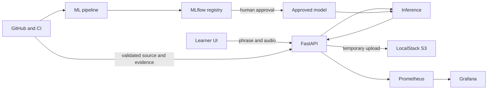
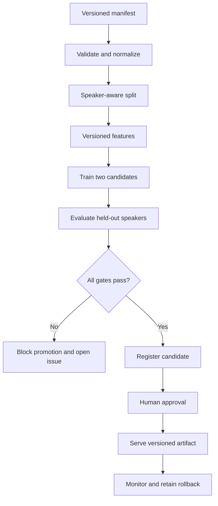

::: {.cover}

# FluentEdge

## Prototype Implementation Document

**Subtitle:** Sprint 4 - Local-first AWS-compatible MLOps prototype for AI-powered speaking feedback<br>
**Student / Sole CLC Team Member:** Daniel Grijalva<br>
**Institution:** Grand Canyon University<br>
**Course:** SWE-452<br>
**Instructor:** Ryan Woodward<br>
**Submission Date:** July 20, 2026<br>
**Document Version:** 4.0<br>
**Document Status:** Final Sprint 4 submission document<br>
**Repository:** [DanielAndi/fluentedge](https://github.com/DanielAndi/fluentedge)<br>
**Repository Baseline (Git SHA-1):** `4e46d3d3047ad0ebaa05caec05de343d12ce3d8a`

:::

<div class="page-break"></div>

## Table of Contents

::: {.toc}

1. [Project Overview](#project-overview)
2. [Requirements](#requirements)
3. [Implementation Plan](#implementation-plan)
4. [Risk Assessment](#risk-assessment)
5. [Test and Validation Plan](#test-validation-plan)
6. [Sprint 4 Project Documentation](#sprint-4-project-documentation)
7. [References](#references)
8. [Appendix A - Sprint 2 Requirements Baseline](#appendix-a)
9. [Appendix B - Sprint 1 Risk Baseline](#appendix-b)
10. [Appendix C - Current Evidence Index](#appendix-c)

:::

<div class="page-break"></div>

# 1. Project Overview {#project-overview}

## 1.1 Objective

FluentEdge demonstrates the first operational phase of an MLOps/cloud project for controlled English speaking feedback. A learner submits an expected phrase and a short audio recording. The service validates and temporarily stores the recording, loads an approved versioned model, and returns a score, a `pass` or `needs_review` label, confidence, feedback categories, model version, request ID, and latency.

The Sprint 4 objective is not to claim production-grade pronunciation assessment. It is to prove that the complete ML lifecycle can be executed and inspected consistently:

1. Validate and version source data.
2. Normalize audio and text deterministically.
3. Produce speaker-aware dataset partitions.
4. Build finite, versioned features.
5. Train and compare at least two candidate models.
6. Apply a measurable evaluation gate.
7. Register and explicitly approve a versioned model.
8. Deploy the approved model through a controlled API.
9. Monitor service health, latency, predictions, and dependencies.
10. Retain a rollback target and trace implementation evidence to requirements.

## 1.2 Measurable Prototype Goals

- Start the complete local stack from documented commands and confirm all required services are healthy.
- Validate a versioned dataset manifest and generate deterministic train, validation, and test assignments.
- Compare at least two baseline classifiers and block promotion below macro F1 `0.75`.
- Require human approval before a registered model can be treated as production-ready.
- Return a deterministic API response with safe errors, request IDs, and no raw audio in logs.
- Expose operational metrics through Prometheus and Grafana.
- Retain the previous approved model as a tested rollback target.
- Trace requirements to code, tests, commits, GitHub issues, reports, and screenshots.
- Record the full SHA-1 Git commit ID and SHA-256 digests for reproducibility-critical artifacts.

## 1.3 Prototype Scope

| In scope | Out of scope |
|---|---|
| Controlled expected-phrase comparison using short audio clips | Unrestricted conversation or a full language-learning platform |
| WAV, FLAC, MP3, and M4A input when decodable | Unsupported or undecodable media |
| 10 MB and 30-second prototype input limits | Long-form audio processing |
| Data schema, validation, normalization, and speaker-aware splitting | Claims that synthetic fixtures represent real student populations |
| Acoustic and text-derived features | Clinical or diagnostic pronunciation assessment |
| Logistic regression and random forest baselines | Large neural models unless added as a separately labeled experiment |
| MLflow experiment tracking, registration, and approval | Automatic model promotion without human review |
| FastAPI learner interface and OpenAPI contract | Enterprise authentication or a commercial mobile application |
| Docker Compose, LocalStack S3, MLflow, Prometheus, and Grafana | Always-on paid AWS infrastructure |
| AWS SAM health adapter and AWS-compatible target mapping | A claim that managed AWS deployment has occurred without evidence |
| GitHub Issues, Project #4, Actions, and stored evidence | Jira and Confluence as active systems; GitHub is the documented replacement |

## 1.4 Stakeholders, Roles, and Responsibilities

| Stakeholder | Role | Responsibilities |
|---|---|---|
| Daniel Grijalva | Project owner and sole CLC team member | Planning, architecture, implementation, model development, testing, documentation, GitHub governance, evidence, and demonstration |
| Ryan Woodward | Instructor and evaluator | Review technical rigor, evidence, completeness, risk treatment, reproducibility, and measurable success criteria |
| Learner / demonstration user | Primary user | Provide an expected phrase and short audio attempt; interpret plain-language prototype feedback |
| Future ML engineer | Technical maintainer | Curate licensed real data, reproduce training, evaluate bias and drift, approve models, and maintain model cards |
| Future DevOps operator | Platform maintainer | Operate containers, storage, observability, secrets, rollback, CI/CD, and an optional approved AWS deployment |

> **CLC status:** This is a one-person CLC. Every implementation, testing, documentation, evidence, and demonstration responsibility is assigned to Daniel Grijalva; there are no omitted team-member contributions.

<div class="page-break"></div>

# 2. Requirements {#requirements}

> **Sprint 2 reference:** Appendix A reproduces the 65 functional and non-functional requirements from `FluentEdge_Sprint2_Design_and_Requirements_Specification.md`. No Sprint 2 identifier is deleted or renumbered. The change log below records implementation clarifications, measured gaps, and Sprint 4 documentation updates.

## 2.1 Requirement Change Log

| Change ID | Area | Updated interpretation | Effect on implementation or validation |
|---|---|---|---|
| RC-01 | Deployment profile | The local Docker implementation is authoritative for the class proof of concept. AWS remains a target mapping. | No managed AWS deployment is claimed without cloud evidence. |
| RC-02 | Project tracking | GitHub Issues and GitHub Project #4 replace Jira and Confluence for task and evidence management. | FR-PM identifiers remain unchanged; evidence uses GitHub links and fields. A waiver should be attached if the instructor requires the named tools. |
| RC-03 | Dataset | The implementation uses 48 synthetic fixtures only. | Functional tests may pass, but real-world validity and subgroup claims remain blocked. |
| RC-04 | Model claims | Macro F1 `1.0` is synthetic functional evidence. | The result cannot be presented as pronunciation accuracy or generalization. |
| RC-05 | Performance | Model-only latency and end-to-end API latency are separate measurements. | A fresh Python 3.11 run measured 30 warm `/predict` requests at p95 `84.749 ms`, below the `2,000 ms` local target. |
| RC-06 | Partitioning | Six speaker groups previously produced an empty validation partition under floor-based splitting. | The allocator now guarantees every requested partition is nonempty when enough speaker groups exist; six groups produce 4/1/1 speaker groups. |
| RC-07 | Dependencies | The audit reports MLflow/pyarrow advisories. | Security acceptance requires upgrade, remediation, or documented risk acceptance. |
| RC-08 | Governance | Evidence documents conflict with open issue states and unchecked acceptance boxes. | Issue status, completion notes, and evidence fields must be reconciled before final acceptance. |
| RC-09 | Cryptographic hashes | Git object IDs use SHA-1; dataset, model, report, and evidence checksums use SHA-256. | Every reproducibility record names the algorithm, digest length, and authoritative value. |
| RC-10 | Latency target | The authoritative local target is warm `/predict` p95 at or below 2.0 seconds across at least 30 requests. | The earlier 800 ms AWS target is retained only as an aspirational future optimization. |
| RC-11 | Repository freshness | Repository `main` was at `4e46d3d3047ad0ebaa05caec05de343d12ce3d8a` before the Sprint 4 hardening work. | The scoped Sprint 4 commit must be pushed after GitHub authentication is repaired; the report does not claim a remote commit that is not visible. |
| RC-12 | Evidence freshness | Executable and local-service screenshot evidence was refreshed on July 20, 2026 local time. | E-11 stores validation/test evidence; E-06 through E-08 contain fresh MLflow, Grafana, Prometheus, and learner-UI captures. |

## 2.2 Reproducibility Requirement Clarification

| Requirement | Sprint 4 clarification |
|---|---|
| FR-DI-006 | The partition manifest shall record seed `42`, speaker/group assignments, and a SHA-256 digest of canonical manifest bytes. |
| FR-ML-002 | `code_version` shall store the full 40-character Git SHA-1 commit ID; `dataset_manifest_sha256` shall store the 64-character SHA-256 digest. |
| FR-ML-007 | The served artifact shall include a version and SHA-256 checksum; the API exposes the version while evidence retains the checksum. |
| FR-INF-006 | Immutable artifact directories shall include the dataset version, run ID, and a SHA-256 inventory or digest file. |
| FR-PM-005 | Requirement-to-commit traceability links the full Git SHA-1 commit ID, even when GitHub displays an abbreviation. |
| NFR-REL-002 | Rollback evidence verifies the previous artifact SHA-256 checksum before loading it. |

## 2.3 Verified Reproducibility Metadata

```yaml
git_object_format: sha1
git_commit_sha1: 4e46d3d3047ad0ebaa05caec05de343d12ce3d8a
dataset_manifest_sha256: 81b47ea142995e7cf6361c8f7e2b0272c78ba66ee94dc8f8393fd56a3b33408e
model_artifact_sha256: c7016b8858bf0efa35c6f364cb2dc1307734d71c33975d299f8e8a0e5ae05e82
random_seed: 42
```

> **Integrity note:** The production model digest was reverified by the Sprint 4 rollback exercise. The complete current inventory is stored in `docs/evidence/E-11-sprint4-validation/artifact-inventory.sha256` and must be regenerated after any listed file changes.

<div class="page-break"></div>

# 3. Implementation Plan {#implementation-plan}

## 3.1 Technical Approach

Sprint 1 proposed an AWS-native architecture using Amazon S3, SageMaker Pipelines, SageMaker Model Registry, a FastAPI container on a SageMaker endpoint, SageMaker Model Monitor, CloudWatch, GitHub Actions, Jira, and Confluence. The implemented prototype preserves the same separation among data ingestion, training, registration, deployment, and monitoring while using a local-first, adapter-based architecture that is practical for the student budget and current course phase.

Application logic can use LocalStack S3 or a filesystem storage adapter, and the API receives environment-driven endpoints that can later map to AWS services. The training pipeline writes immutable run artifacts, records experiments in MLflow, requires explicit human approval, and serves only a versioned model. Prometheus scrapes application metrics, Grafana presents the operations dashboard, and GitHub Actions supplies repeatable quality, security, container, and documentation checks.



### Sprint 1 Design-to-Prototype Alignment

| Sprint 1 proposal choice | Implemented prototype choice | Alignment or documented change |
|---|---|---|
| Common Voice public-data subset | 48 synthetic functional fixtures | Pipeline wiring is demonstrable, but public-data validity remains a blocking validation task. |
| Amazon S3 | LocalStack S3 plus filesystem adapter | Preserves an S3-compatible contract without requiring paid cloud resources. |
| SageMaker Pipelines | Reproducible local pipeline and Make targets | Implements the same gated ingest-through-register lifecycle locally. |
| SageMaker Model Registry | MLflow tracking and model registry | Preserves version, metrics, artifact, and human-approval metadata. |
| FastAPI container on SageMaker endpoint | Local FastAPI Docker container | Preserves the REST inference contract and container portability; managed AWS deployment is not claimed. |
| SageMaker Model Monitor and CloudWatch | Prometheus and Grafana | Preserves operational monitoring for traffic, errors, latency, prediction distribution, confidence, and model version. |
| GitHub Actions or AWS CodeBuild | GitHub Actions | Preserves automated formatting, linting, testing, build, security, and documentation evidence. |
| Jira and Confluence | GitHub Issues, GitHub Project #4, and repository evidence | Implements the approved project-management replacement while keeping task, decision, risk, and evidence traceability. |

### Local-to-AWS Mapping

| Local component | Current responsibility | Future AWS mapping |
|---|---|---|
| FastAPI container | Validation, inference orchestration, response contract | API Gateway plus Lambda or managed container service |
| LocalStack S3 / filesystem | Temporary upload and artifact storage | Amazon S3 |
| Local pipeline | Validation, features, training, evaluation | SageMaker Processing, Training, and Pipelines |
| MLflow | Experiment tracking, registry, approval metadata | SageMaker Model Registry or approved managed registry |
| Prometheus / Grafana | Metrics and operations dashboard | CloudWatch metrics, logs, alarms, and dashboards |
| GitHub Actions | CI, security, container, and documentation checks | GitHub Actions with approved OIDC-based AWS access |

## 3.2 Infrastructure Setup

1. Clone [DanielAndi/fluentedge](https://github.com/DanielAndi/fluentedge).
2. Check out and verify full SHA-1 commit ID `4e46d3d3047ad0ebaa05caec05de343d12ce3d8a`.
3. Run `git rev-parse --show-object-format`; the expected result for this baseline is `sha1`.
4. Copy `.env.example` to `.env`, retain placeholder local credentials only, and never commit `.env`.
5. Use Python 3.11 or the documented Docker commands because the project requires Python `>=3.11,<3.12`.
6. Run `make setup` and then `make up` to build and start LocalStack, MLflow, FastAPI, Prometheus, and Grafana.
7. Run `make bootstrap` twice to prove idempotent S3-compatible bucket initialization.
8. Run `make health` and retain service-state output.
9. Generate fixtures, validate data, run the local pipeline, and approve the intended MLflow model version.
10. Set the approved model URI/version in `.env`, restart the API, and verify `/ready` and `/predict`.
11. Calculate SHA-256 digests for the dataset manifest, model artifact, model card, and evaluation report.
12. Execute the full test matrix and store the results before recording the demonstration.

### Reproducible Checkout Commands

```bash
git clone https://github.com/DanielAndi/fluentedge.git
cd fluentedge
git checkout 4e46d3d3047ad0ebaa05caec05de343d12ce3d8a
git rev-parse --show-object-format
git rev-parse HEAD
```

Expected authoritative values:

```text
sha1
4e46d3d3047ad0ebaa05caec05de343d12ce3d8a
```

## 3.3 Component Work Packages

| Work package | Area | Execution | Output | Current state |
|---|---|---|---|---|
| WP-1 | Data contract | Validate fields, duplicates, readability, duration, size, media type, and manifest version | Schema, validation report, negative fixtures | Complete on fixtures |
| WP-2 | Reproducible preparation | Normalize audio/text, assign speaker-aware partitions, version features, calculate manifest SHA-256 | Clean manifest, normalized audio, feature table | Nonempty deterministic split guard complete; public data remains open |
| WP-3 | Model development | Train logistic regression and random forest with seed 42; compare metrics and latency | Evaluation report, joblib model, model card | Complete on fixtures |
| WP-4 | Registry and approval | Log full Git SHA-1 commit ID, SHA-256 artifact digests, metrics, and approval state | MLflow run, approved version, checksums | Version 1 approved; hash metadata to standardize |
| WP-5 | Inference API | Validate request, generate request ID, store temporarily, load approved model, predict, delete upload, return typed response | FastAPI routes and OpenAPI contract | Functional |
| WP-6 | Learner interface | Provide upload/record controls and plain-language output | Static UI and screenshot | Functional baseline |
| WP-7 | Observability | Export request, error, latency, label, confidence, version, and dependency metrics | Prometheus configuration and Grafana dashboard | Functional baseline |
| WP-8 | CI and governance | Run format, lint, tests, secret scan, dependency scan, Compose validation, container smoke, and docs checks | Actions runs, issues, evidence index | Local format/lint/tests pass; audit has 32 findings; authenticated GitHub refresh blocked |
| WP-9 | Validation hardening | Add licensed public data, valid partitioning, load/concurrency, failure, rollback, startup repetition, and dependency remediation | New reports and issue closure evidence | Split, load, concurrency, failure, rollback, and startup complete; real data and dependencies open |
| WP-10 | Sprint 4 submission | Consolidate current status, requirements, risk, test plan, evidence, and video walkthrough | Markdown/PDF report and hosted video plan | Markdown/PDF and local evidence complete; hosted video remains owner action |

## 3.4 Model Development and Promotion Workflow



Detailed steps:

1. Ingest a versioned manifest and reject blocking validation errors.
2. Normalize audio to mono 16 kHz PCM and normalize expected text deterministically.
3. Serialize the canonical manifest and calculate its SHA-256 digest.
4. Assign speaker-aware partitions and abort if a mandatory partition is empty.
5. Build finite, versioned features and preserve their schema.
6. Train at least two candidates using recorded parameters and seed `42`.
7. Evaluate held-out speakers using macro F1, per-class precision/recall, confusion matrix, WER, CER, and latency.
8. Block promotion below macro F1 `0.75` or when any data-integrity gate fails.
9. Log the full Git SHA-1 commit ID and SHA-256 dataset/model/report digests in MLflow and the model card.
10. Require explicit human approval and retain the prior approved version for rollback.
11. Deploy the approved version and validate end-to-end behavior before recording evidence.

## 3.5 Monitoring and Logging Plan

| Concern | Signal | Cadence | Trigger | Required response |
|---|---|---|---|---|
| Availability | Dependency status, `/health`, `/ready` | Every scrape and demonstration checkpoint | Dependency down or approved model unavailable | Return controlled error; investigate by request ID; open issue after reproducible failure |
| Traffic | Request count and status | Continuous | Unexpected 4xx/5xx increase | Inspect error-code distribution and request IDs |
| Latency | End-to-end request latency | Continuous; p50/p95 review | Warm `/predict` p95 above 2.0 seconds | Profile decode, features, model loading, inference, and storage |
| Predictions | Label count and confidence distribution | Per request and sprint review | Material distribution shift | Freeze retraining; inspect data and model behavior |
| Model | Active version, approval tag, artifact SHA-256 | Startup and every release | Unexpected version, missing approval, or checksum mismatch | Stop deployment and restore last verified approved version |
| Privacy | Metadata-only logs and retention cleanup | Per request and daily cleanup | Raw audio, token, transcript, or expired object found | Delete evidence, rotate credential if needed, open incident issue |
| Governance | CI state, open risks, requirement/evidence fields | Every pull request and sprint close | Failed gate or stale issue state | Block closure until evidence is reconciled |

Logging rules:

- Log timestamp, request ID, route, status, duration, model version, and safe error code.
- Do not log raw audio, authorization headers, access tokens, or full transcripts.
- Record SHA-256 checksum failures as controlled integrity events without logging private artifact contents.
- Use structured JSON logs where supported.

## 3.6 Milestones, Deadlines, and Exit Evidence

| Milestone | Target | Deliverable | Exit evidence | State |
|---|---|---|---|---|
| Sprint 1 - Proposal | June 28, 2026 | Objective, scope, AWS-native technical direction, and eight initial risks | 16-page proposal and baseline risk assessment | Historical |
| Sprint 2 - Design and local baseline | July 6-8, 2026 | Requirements, architecture, code skeleton, local stack, CI, and evidence | Specification, reports, screenshots, Actions links | Implemented; issue states remain open |
| Sprint 3 - Prototype implementation | July 12, 2026 | Implementation document, updated risk, test plan, and current prototype | 18-page PDF and repository evidence | Completed baseline |
| Sprint 4 - Documentation and demo | July 20, 2026 submission | Updated implementation document, evidence audit, and video walkthrough | This Markdown/PDF plus uploaded video link | Local package complete; video and remote publication blocked |
| Final - Release and presentation | August 9, 2026 | Reproducible release, reconciled issues, final demonstration and evidence package | Tagged release, closed acceptance issues, final presentation | Planned |

<div class="page-break"></div>

# 4. Risk Assessment {#risk-assessment}

Appendix B reproduces the eight risks from the Sprint 1 proposal's page 13 risk assessment. The updated register below retains those concerns, adds risks discovered through implementation and instructor feedback, and converts the original qualitative ratings into a reviewable Probability x Impact scale. Scores `1-5` are Low, `6-10` are Moderate, `11-15` are High, and `16-25` are Critical. Daniel Grijalva owns every active response as the sole team member.

## 4.1 Updated Risk Register

| ID | Risk | P | I | Score | Mitigation / contingency | Trigger |
|---|---|---:|---:|---:|---|---|
| R-01 | Synthetic-data validity | 5 | 5 | 25 Critical | Use a licensed public speech subset with a completed dataset card; separate fixture metrics from validation metrics | Public-data evaluation cannot be reproduced or misses the quality gate |
| R-02 | Overfitting or leakage | 4 | 5 | 20 Critical | Require speaker-disjoint, non-empty partitions, canonical manifest SHA-256, and grouped cross-validation for small samples | Perfect fixture metrics, duplicate speakers, leakage, or empty validation partition |
| R-03 | Accent or subgroup bias | 4 | 5 | 20 Critical | Do not claim fairness; collect licensed metadata; report only groups with at least 100 examples; require human review | Material subgroup gap or insufficient metadata |
| R-04 | End-to-end latency | 2 | 4 | 8 Moderate | Keep the verified artifact cached and rerun the 30-request profile after model or feature changes | Warm `/predict` p95 exceeds 2.0 seconds; Sprint 4 result is 84.749 ms |
| R-05 | Dependency vulnerabilities | 4 | 4 | 16 Critical | Upgrade MLflow/pyarrow on a branch, rerun regression tests, and block final release on unresolved high-severity findings without acceptance | Dependency scan continues to report actionable vulnerabilities |
| R-06 | Local/AWS parity | 3 | 4 | 12 High | Keep storage adapters and environment configuration; test SAM path; avoid cloud claims without evidence | Behavior changes when endpoint or environment configuration changes |
| R-07 | Rollback failure | 2 | 4 | 8 Moderate | Reject a mismatched candidate, verify the approved SHA-256, atomically restore it, and load-test the restored artifact | Previous artifact cannot be verified or loaded after restoration |
| R-08 | Privacy or retention failure | 2 | 5 | 10 Moderate | Immediate post-inference deletion, 24-hour maximum cleanup, generated keys, log redaction, and retention tests | Raw audio remains, sensitive marker appears, or path traversal succeeds |
| R-09 | Single-developer capacity | 4 | 3 | 12 High | Prioritize blocking acceptance gates, automate evidence, time-box optional AWS/neural work, and maintain a reproducible runbook | Critical work slips or evidence and issue state diverge |
| R-10 | Governance inconsistency | 4 | 3 | 12 High | Update issue boxes, evidence fields, statuses, deadlines, and completion notes at each sprint close | Repository reports completion while issues remain open/evidence-required |
| R-11 | Reproducibility hash ambiguity | 3 | 4 | 12 High | Name SHA-1 for Git object IDs and SHA-256 for artifact integrity; store full digests and algorithm labels | Evidence records only “SHA,” an abbreviated commit, or an unlabeled digest |
| R-12 | Service availability | 2 | 3 | 6 Moderate | Health checks, dependency timeouts, controlled 503 errors, persistent approved artifact, and two clean-start tests | A dependency blocks the API or startup is not repeatable |
| R-13 | Cloud cost or credentials | 2 | 3 | 6 Moderate | Keep required demo local, use placeholders, require manual approval and cleanup plan for any AWS test | Unexpected AWS charge, long-lived key, or automatic deployment |
| R-14 | Model or data drift | 3 | 4 | 12 High | Monitor prediction distribution, feature summaries, confidence, labels, and WER/CER when ground truth exists; open a retraining issue and retain rollback | Material input/prediction shift, quality degradation, or sustained confidence change |
| R-15 | Evidence freshness / stale baseline | 4 | 4 | 16 Critical | Rerun tests, health checks, performance, prediction, and screenshots immediately before recording; commit or clearly label the new evidence package | Submission relies entirely on July 8 results or claims work not present in the repository |

## 4.2 Risk Changes Since Sprint 1

| Direction | Risk area | Rationale |
|---|---|---|
| Mixed | Data validity and overfitting | The nonempty fixture split is corrected, but perfect synthetic scores still leave real-data generalization and leakage as critical risks |
| Reduced | Performance | The fresh 30-request run measured warm `/predict` p95 at 84.749 ms against the 2-second target |
| New | Dependency vulnerabilities | The stored audit reports advisories in pinned MLflow/pyarrow dependencies |
| New | Governance inconsistency | Sprint 2 issues remain open while newer evidence documents report completion |
| New | Hash ambiguity | Instructor feedback requires the exact SHA version; unlabeled or abbreviated hashes are no longer acceptable |
| Reduced | Evidence freshness | Python 3.11 test, coverage, performance, concurrency, startup, rollback, and audit evidence was refreshed on July 20 |
| Reduced | Cloud cost and credentials | The required implementation remains local-first and has no automatic managed AWS deployment |
| Reduced | Privacy exposure | Generated storage keys, deletion, retention cleanup, path-safety tests, and log redaction exist |
| Unchanged | Bias, local/AWS parity, and drift | No real demographic dataset, managed AWS validation, or production traffic exists, so these risks remain unresolved |

## 4.3 Risk Review Cadence

- Review the register before a sprint starts, before model approval, before recording the demonstration, and before closing a milestone.
- Open a GitHub issue for every triggered High or Critical risk and link affected requirement IDs.
- Do not lower a risk score merely because a control exists; lower it only after the control is tested and evidence is stored.
- Record accepted residual risk in the model card and release notes.
- Verify that every recorded digest identifies `sha1` or `sha256` and has the correct length.
- Rerun and timestamp executable evidence immediately before recording and submission.

<div class="page-break"></div>

# 5. Test and Validation Plan {#test-validation-plan}

## 5.1 Testing Objectives

- Verify that data ingestion rejects unsafe or invalid inputs and produces deterministic normalized artifacts.
- Verify that model training is reproducible, compares multiple candidates, and blocks promotion below the quality gate.
- Verify that the full Git SHA-1 commit ID and SHA-256 artifact digests reproduce the intended run inputs and outputs.
- Verify that only an explicitly approved, versioned model is served and that rollback restores the prior verified version.
- Verify the API contract, errors, privacy controls, storage cleanup, request IDs, and metrics.
- Measure end-to-end performance, concurrency, startup repeatability, and failure behavior rather than model inference time alone.
- Confirm that CI, evidence links, and GitHub issue states agree before PoC acceptance.
- Rerun core evidence immediately before the Sprint 4 demo so the recorded video reflects the submitted state.

## 5.2 Test Environment

| Dimension | Configuration |
|---|---|
| Runtime | Python 3.11; the project excludes Python 3.12 or later for this baseline |
| Container platform | Docker Engine/Desktop with Compose and the named `fluentedge` network |
| Services | FastAPI `:8000`, MLflow `:5000`, LocalStack S3 `:4566`, Prometheus `:9090`, Grafana `:3000` |
| Test automation | pytest, pytest-asyncio, Ruff, pip-audit, Gitleaks, GitHub Actions, Compose validation, and container smoke tests |
| Model stack | NumPy, pandas, scikit-learn, librosa, soundfile, jiwer, joblib, and MLflow 2.18.0 baseline |
| Git identity | Full SHA-1 commit ID `4e46d3d3047ad0ebaa05caec05de343d12ce3d8a` |
| Artifact integrity | SHA-256 digest for manifest, features, model, model card, evaluation report, and evidence inventory |
| Evidence baseline | Executable reports refreshed July 20, 2026; authenticated service/browser screenshots remain from July 6-8 |

## 5.3 Test Data

| Dataset | Location / source | Composition | Purpose |
|---|---|---|---|
| Synthetic manifest | `tests/fixtures/synthetic/manifest.json` | 48 WAV clips; 6 synthetic speakers; 8 expected phrases; 24 `pass` and 24 `needs_review` labels | Unit, pipeline, API, and smoke tests only |
| Negative fixtures | Corrupt, too-long, oversized, unsupported, missing-prompt, and boundary inputs | Decode failure, duration, size, type, and request-boundary cases | Deterministic error-code validation |
| Current partition | Seed 42 and speaker-aware 70/15/15 implementation | 4 train, 1 validation, and 1 test speaker group; 32/8/8 clips for the balanced fixture | Functional partition gate passes; public-data validity remains open |
| Planned public set | Licensed Mozilla Common Voice English subset or approved equivalent | Version, locale, license, checksum, date, clip count, duration, speaker distribution, and limitations recorded | Real-world validation and subgroup analysis |
| Operational load set | At least 30 warm valid requests plus invalid and concurrent batches | Representative 1-10 second clips and at least five simultaneous clients | p50/p95 latency, reliability, and corruption checks |

> **Validation rule:** Synthetic fixtures may satisfy functional pipeline tests, but they may not support claims of real-world speaking accuracy, demographic fairness, or production readiness.

## 5.4 Detailed Test Matrix

| ID | Area | Test | Expected result | Method | Current evidence |
|---|---|---|---|---|---|
| T-01 | Data | Valid manifest and WAV set | 48 of 48 rows valid; no blocking issue | Automated | Pass in stored evidence |
| T-02 | Data | Missing field, duplicate ID/path, unreadable audio | Each category identified and pipeline blocked | Automated | Implemented |
| T-03 | Input | Unsupported, corrupt, above 10 MB, or above 30 seconds | Deterministic 4xx/413/415, safe message, request ID | Automated | Implemented; rerun required |
| T-04 | Preprocessing | Audio normalization | Mono 16 kHz PCM with finite waveform | Automated | Implemented |
| T-05 | Text | Whitespace, case, and punctuation cases | Exact golden normalized text | Automated | Implemented |
| T-06 | Split | Same seed and speaker IDs | Identical assignment, no overlap, all mandatory partitions non-empty | Automated | Pass; six-speaker regression covered |
| T-07 | Hashing | Repository identity | `git rev-parse --show-object-format` returns `sha1`; full commit matches baseline | Automated/manual | Planned explicit evidence |
| T-08 | Hashing | Manifest and artifact integrity | Recalculated SHA-256 values exactly match stored 64-character digests | Automated | Pass; inventory stored in E-11 |
| T-09 | Features | Build feature frame | Required schema exists; no NaN/Inf; version recorded | Automated | Implemented |
| T-10 | Training | Train two candidates | Both fit from clean checkout using seed 42 | Automated/integration | Pass on fixtures |
| T-11 | Evaluation | Held-out candidate comparison | Macro F1, class metrics, confusion, WER/CER, and latency recorded | Automated/integration | Pass on fixtures |
| T-12 | Gate | Candidate below macro F1 0.75 | Promotion blocked and remediation decision recorded | Automated | Negative gate test planned |
| T-13 | Registry | Unapproved versus approved version | Unapproved load fails; approved version is traceable | Automated/manual | Approval evidenced |
| T-14 | API | `GET /health` and `/ready` | Schema valid; dependency/model states accurate; no secrets | Automated/smoke | Pass |
| T-15 | API | Valid `POST /predict` | Required fields, label domain, request ID, version, latency, cleanup | Automated/smoke | Pass; latency gap |
| T-16 | API | Missing prompt, bad media, decode failure | Stable safe error code, status, and request ID | Automated | Pass |
| T-17 | Security | Filename path traversal | Generated object key; no escape from storage root | Automated | Pass |
| T-18 | Privacy | Sensitive log markers | No raw audio, bearer token, authorization header, or full transcript | Automated | Pass |
| T-19 | Retention | Expired and successful upload cleanup | Successful inference deletes immediately; fallback within 24 hours | Automated/manual | Baseline pass |
| T-20 | Storage | Filesystem and LocalStack adapters | Put/get/list/delete/cleanup behavior equivalent | Automated/integration | Baseline pass |
| T-21 | Performance | 30 warm `/predict` requests | p95 at or below 2.0 seconds for clips at or below 10 seconds | Load | Pass; p95 84.749 ms |
| T-22 | Performance | 30 `/health` requests | p95 below 250 ms | Load | Pass; p95 36.732 ms |
| T-23 | Concurrency | Five simultaneous valid requests | No corruption, duplicate IDs, or uncontrolled errors | Load | Pass; five unique IDs and zero leftover uploads |
| T-24 | Reliability | Disable storage or model/registry dependency | Controlled 503; API remains alive; failure metric increments | Failure injection | Pass; storage and model-load tests return controlled 503 contracts |
| T-25 | Rollback | Reject bad candidate then restore approved artifact | Previous SHA-256-verified model is restored and loadable | Automated/integration | Pass; approved SHA-256 restored exactly |
| T-26 | Startup | Two clean start/bootstrap/health cycles | API, storage, model, and dependency health pass twice | System | Pass; two fresh startup logs stored |
| T-27 | Observability | Generate prediction activity | Dashboard shows traffic, latency, dependency health, and prediction label | Manual/system | Pass; Grafana, Prometheus, MLflow, and learner UI recaptured |
| T-28 | CI | Push or pull request | Format, lint, unit, Compose, container, docs, and secret checks pass | Automated | Local Python 3.11: format/lint pass; 45 pass, 2 skip |
| T-29 | Dependencies | Locked dependency audit | No unresolved Critical/High finding or signed risk acceptance | Automated/review | Fail; 32 findings in MLflow 2.18.0 and pyarrow 18.1.0 |
| T-30 | Governance | Trace requirement to issue, full commit ID, test, and evidence | Links resolve and issue completion state matches evidence | Manual/review | Reconciliation required |
| T-31 | Usability | Learner completes one attempt | Plain-language result, non-clinical wording, understandable error recovery | Manual | Baseline UI reviewed |
| T-32 | Freshness | Rerun submission evidence | Current timestamped test, health, predict, and dashboard evidence matches the demo | Manual/system | Local evidence refreshed; GitHub screenshots and video open |

## 5.5 Current Evidence Summary

| Evidence | Stored result | Interpretation |
|---|---|---|
| Unit test suite | 45 passed, 2 skipped, 1 integration test deselected | Functional baseline and new hardening regressions pass on Python 3.11 |
| Format and lint | 57 files formatted; Ruff check passes | Local quality gates pass |
| Data validation | 48 of 48 rows valid | Synthetic manifest is internally valid |
| Model comparison | Logistic regression and random forest both macro F1 1.0 | Pipeline is functional; result is not real-world accuracy evidence |
| Model registry | Version 1 approved | Human approval path is present |
| Container smoke | Pass | API image builds and exposes health route |
| Service health | Six required checks pass | Local stack is demonstrable |
| `/health` latency | p95 36.732 ms across 30 samples | Passes the 250 ms gate |
| `/predict` latency | warm p95 84.749 ms across 30 samples | Passes the 2-second local gate for the fixture |
| Concurrency/startup/rollback | Five-way concurrency, two starts, and verified rollback pass | Reliability hardening is evidenced locally |
| Security | Prior Gitleaks evidence passes; fresh dependency audit finds 32 advisories | Dependency gate remains blocked pending upgrade or signed acceptance |

## 5.6 PoC Success Criteria

| Criterion | Measurable threshold | Gate | Required evidence |
|---|---|---|---|
| Functional pipeline | Clean manifest completes validate -> preprocess -> split -> features -> train -> evaluate -> register | Blocking | Pipeline result and immutable artifacts |
| Reproducibility | Full 40-character Git SHA-1 commit ID and matching SHA-256 digests reproduce run inputs/outputs using the recorded seed | Blocking | Run metadata, checksum inventory, rerun transcript |
| Model quality | At least two candidates; selected real-data model macro F1 at least 0.75 with no unresolved leakage or empty partition | Blocking | Evaluation report and model card |
| Approval and rollback | Only human-approved version serves; previous SHA-256-verified version restores successfully | Blocking | MLflow tags and rollback transcript |
| API correctness | Contract, negative, privacy, retention, storage, and path-traversal tests pass | Blocking | JUnit/coverage and API samples |
| Performance | Warm `/predict` p95 at or below 2.0 seconds across at least 30 requests; `/health` p95 below 250 ms; five concurrent requests without corruption | Blocking | Load-test JSON and dashboard |
| Reliability | Controlled dependency failure and two consecutive clean startups pass | Blocking | Failure-injection and startup logs |
| Security | Secret scan passes; no unresolved Critical/High dependency issue without documented acceptance | Blocking | Gitleaks and dependency audit artifacts |
| Observability | Required metrics are visible and associated with request/model version | Required | Prometheus/Grafana evidence |
| Reproducible operation | Reviewer can start, test, train, approve, and demonstrate on Python 3.11/Docker from the documented baseline | Blocking | Fresh-checkout run log |
| Governance | Requirements trace to current issue state, evidence, deadlines, and completion notes | Required | GitHub Project and audit evidence |
| Evidence freshness | Video and submitted report reference the same current baseline and timestamped reruns | Required | Fresh test logs, screenshots, and video link |

## 5.7 Entry, Exit, and Defect Rules

- **Entry:** Code is on the recorded full SHA-1 commit; environment uses Python 3.11; fixtures and approved data are versioned; SHA-256 manifests exist; required services are healthy.
- **Exit:** Every Blocking criterion passes; evidence is stored; limitations are in the model card; related GitHub issues contain accurate completion notes.
- A failed Blocking test prevents PoC acceptance and cannot be converted to a pass through narrative explanation alone.
- A deferred optional requirement must identify owner, rationale, target sprint, and evidence that the deferral does not invalidate a mandatory criterion.
- Defects receive severity, affected requirement IDs, reproduction steps, expected/actual behavior, evidence, and retest result.
- **Freshness:** Any result shown in the video must be reproducible from the same repository baseline cited in the document.

> **Current validation decision:** The repository demonstrates a functional prototype and now passes the local partition, API performance, health performance, concurrency, controlled-failure, startup, rollback, unit-test, lint, artifact-integrity, and local observability-evidence gates. Final PoC acceptance is still blocked by licensed real-data validity, dependency remediation or signed risk acceptance, authenticated GitHub governance/Actions evidence, and the hosted demonstration video.

<div class="page-break"></div>

# 6. Sprint 4 Project Documentation {#sprint-4-project-documentation}

## 6.1 Nature and Scope of Sprint 4 Tasks

Sprint 4 converts the existing functional prototype and Sprint 3 report into a current, reviewable submission package. The sprint scope includes documentation, evidence reconciliation, demonstration planning, and executable validation hardening. Remote GitHub state is reported separately because the configured `gh` token is invalid and no unauthenticated write is claimed.

| Task area | Sprint 4 scope |
|---|---|
| Documentation consolidation | Update project overview, requirements, implementation plan, risk register, test plan, and appendices. |
| Repository audit | Verify current baseline commit, README setup path, issue status, CI/test evidence, and known limitations. |
| Rubric alignment | Explicitly document work scope, sole-member contributions, challenges, responsibilities, completed code, and deadlines. |
| Demonstration preparation | Prepare a timed code walkthrough and current-progress demo script with exact commands and evidence checkpoints. |
| Validation planning | Convert open technical gaps into measurable tests and blocking acceptance criteria. |
| Validation execution | Correct partition allocation and execute performance, concurrency, controlled-failure, startup, rollback, test, coverage, and dependency-audit checks. |

## 6.2 Specific Work Completed by Daniel Grijalva

| Completed activity | Detailed contribution |
|---|---|
| Project and document audit | Reviewed the Sprint 3 implementation document, Sprint 4 rubric, repository baseline, README, API orchestration, ML pipeline, speaker split logic, and open governance evidence. |
| Requirements update | Retained all 65 Sprint 2 requirements and documented twelve current clarifications without renumbering identifiers. |
| Risk update | Extended the register to fifteen risks and added evidence-freshness treatment for the gap between the July 8 repository baseline and July 20 submission. |
| Test-plan update | Expanded the detailed matrix to 32 tests, added a submission-freshness test, and preserved measurable blocking thresholds. |
| Implementation trace | Mapped learner UI, FastAPI, inference orchestration, storage adapters, ML pipeline, MLflow registry, Prometheus/Grafana, and CI to current work packages. |
| Professional deliverables | Prepared the comprehensive Markdown/PDF report, visible architecture/workflow diagrams, and a timed video walkthrough plan. |
| Validation hardening | Implemented the nonempty split allocator, added failure-injection regressions, and created a repeatable Python 3.11 validation harness. |
| Fresh evidence | Recorded 30-request prediction and health measurements, five-way concurrency, two clean starts, SHA-256 rollback, 45 passing tests, coverage, and dependency findings. |

## 6.3 Challenges and Issues Addressed

| Challenge | Treatment |
|---|---|
| Sole-member workload | All team roles are assigned to one person; work is prioritized around blocking acceptance gates and reproducible documentation. |
| Synthetic-only validation | The document separates functional fixture results from real-world accuracy claims and keeps real-data acceptance open. |
| Empty validation partition | Replaced floor-only allocation with deterministic minimum allocation and added a six-speaker regression test. |
| Slow end-to-end prediction | Replaced the single cold historical sample with 30 warm end-to-end measurements; p95 is 84.749 ms. |
| Open issue states | The report explicitly records the mismatch between evidence documents and unchecked/open GitHub issues. |
| Jira/Confluence wording | GitHub Issues and Project #4 are documented as the replacement; no unverified Jira or Confluence update is claimed. |
| Stale execution evidence | Refreshed executable, learner-UI, MLflow, Grafana, and Prometheus evidence; authenticated GitHub Actions/Project evidence remains open. |
| Vulnerable dependencies | Recorded all 32 fresh findings without silently accepting them; upgrade testing or signed risk acceptance remains blocking. |

## 6.4 Responsibilities Assigned

| Assignee | Role | Responsibilities |
|---|---|---|
| Daniel Grijalva | Owner and sole CLC member | Run the stack and tests; maintain code; update GitHub issues/project; collect evidence; resolve or accept risks; record and upload the demonstration; submit the PDF and hosted video URL. |
| Ryan Woodward | Instructor and evaluator | Review whether the GitHub replacement is acceptable, verify evidence, and evaluate unresolved blocking criteria. |
| Future maintainer | Deferred technical role | Add licensed real data, remediate dependencies, validate managed-service parity, and maintain the evidence automation. |

## 6.5 Completed Coding Available for Demonstration

| Code / configuration | Demonstrable responsibility |
|---|---|
| `api/app/main.py` | Creates the FastAPI application, mounts the learner UI, injects request IDs, records request metrics, and exposes `/metrics`. |
| `api/app/routers/predict.py` | Accepts `expected_phrase` and audio, records metadata-only logs, invokes inference, updates model/prediction metrics, and returns the typed response. |
| `api/app/services/inference.py` | Validates media, stores the upload temporarily, loads the approved model, normalizes audio/text, performs prediction, and deletes the upload. |
| `ml/pipeline/local_pipeline.py` | Runs validate -> preprocess -> split -> features -> train -> evaluate -> gate -> model card -> MLflow register. |
| `ml/data/split.py` | Performs deterministic speaker-aware splitting, guarantees requested nonempty partitions when possible, and computes a SHA-256 manifest hash. |
| `scripts/run_sprint4_validation.py` | Executes two startup cycles, 30 prediction and health requests, five-way concurrency, cleanup checks, and SHA-256 rollback. |
| `infrastructure/compose.yaml` | Defines the local service stack for API, storage, MLflow, Prometheus, and Grafana. |
| `.github/workflows/` | Runs format, lint, tests, secret scan, dependency audit, Compose validation, container smoke, and documentation checks. |

## 6.6 Current and Future Deadlines

| Date / window | Deadline | Expected output |
|---|---|---|
| July 20, 2026 | Submit Sprint 4 PDF and hosted video URL | Current submission package |
| Before recording | Capture current GitHub Actions/Project screens; record and upload the walkthrough | Owner-authenticated evidence checkpoint |
| Next implementation session | Acquire and document a licensed public validation subset; test a supported MLflow/pyarrow upgrade | Highest-priority technical work |
| Before final release | Resolve or sign acceptance for dependency findings and reconcile GitHub Project issue fields | Remaining blocking acceptance work |
| August 9, 2026 | Final reproducible release and presentation | Planned final milestone |

## 6.7 Submission Readiness Statement

> **Ready for document submission:** The report follows the required section structure, begins each major section on a new page, includes detailed implementation and validation plans, preserves the required Sprint 2 and Sprint 1 appendices, identifies the sole CLC member, and supports a separate hosted video demonstration.

> **Not yet final PoC acceptance:** Local hardening and service screenshot gates pass, but the document intentionally does not claim real-data validation, dependency acceptance, authenticated GitHub reconciliation/Actions evidence, Confluence approval, or a hosted video. The video should demonstrate current progress and limitations rather than claim production readiness.

<div class="page-break"></div>

# 7. References {#references}

Amazon Web Services. (n.d.-a). *Implement MLOps*. Amazon SageMaker AI Developer Guide. https://docs.aws.amazon.com/sagemaker/latest/dg/mlops.html

Amazon Web Services. (n.d.-b). *What is the AWS Serverless Application Model (AWS SAM)?* https://docs.aws.amazon.com/serverless-application-model/latest/developerguide/what-is-sam.html

DanielAndi. (2026). *FluentEdge* [Source code repository]. GitHub. https://github.com/DanielAndi/fluentedge

Git. (n.d.). *git-rev-parse documentation*. https://git-scm.com/docs/git-rev-parse

Git. (n.d.). *Hash function transition*. https://git-scm.com/docs/hash-function-transition

GitHub. (n.d.). *About Projects*. GitHub Docs. https://docs.github.com/en/issues/planning-and-tracking-with-projects/learning-about-projects/about-projects

Grijalva, D. (2026). *FluentEdge design and requirements specification* (Version 2.0) [Project document]. Grand Canyon University.

Grijalva, D. (2026, June 28). *FluentEdge MLOps Sprint 1 proposal: AWS MLOps pipeline for AI-powered speaking feedback* [Project proposal]. Grand Canyon University.

Grijalva, D. (2026, July 12). *FluentEdge prototype implementation document* (Version 3.3) [Project document]. Grand Canyon University.

Mozilla Foundation. (n.d.). *Common Voice datasets*. https://commonvoice.mozilla.org/en/datasets

National Institute of Standards and Technology. (2015). *Secure Hash Standard (SHS)* (FIPS PUB 180-4). https://csrc.nist.gov/pubs/fips/180-4/upd1/final

<div class="page-break"></div>

# Appendix A - Sprint 2 Requirements Baseline {#appendix-a}

> **Source:** The 65 requirement rows below are reproduced from `FluentEdge_Sprint2_Design_and_Requirements_Specification.md`, version 2.0. Sprint 4 interpretations and changes appear in Section 2 so this appendix remains the baseline.

## A.1 Data Input and Preprocessing Requirements

| ID | Priority | Requirement | Acceptance criterion |
|---|---|---|---|
| FR-DI-001 | Must | The system shall accept WAV, FLAC, MP3, or M4A input that can be decoded by the selected audio library. | Automated tests accept supported samples and reject unsupported or corrupt files. |
| FR-DI-002 | Must | The API shall reject files larger than 10 MB and audio longer than 30 seconds for the prototype. | Boundary tests return documented 4xx responses. |
| FR-DI-003 | Must | The system shall normalize training and inference audio to mono 16 kHz PCM before feature extraction. | Unit test verifies sample rate, channels, and output shape. |
| FR-DI-004 | Must | The preprocessing stage shall validate required metadata fields, missing values, duplicate clip IDs, duplicate paths, and unreadable files. | Validation report identifies each failure category. |
| FR-DI-005 | Must | Text normalization shall lowercase input, normalize whitespace, and apply documented punctuation rules. | Golden test cases match expected normalized text. |
| FR-DI-006 | Must | Train, validation, and test splits shall be reproducible and speaker-aware when speaker identifiers are available. | Repeated runs with the same seed produce identical manifests and no speaker overlap. |
| FR-DI-007 | Should | The pipeline should calculate transcript similarity, WER, CER, duration, speech rate, MFCC statistics, and signal-quality indicators. | Feature schema contains all implemented features with no invalid numeric values. |

## A.2 ML Model Requirements

| ID | Priority | Requirement | Acceptance criterion |
|---|---|---|---|
| FR-ML-001 | Must | The baseline model shall classify attempts as `pass` or `needs_review`. | Held-out predictions use only the defined labels. |
| FR-ML-002 | Must | The training process shall log parameters, code version, dataset manifest hash, metrics, and artifact path. | MLflow run contains each required field. |
| FR-ML-003 | Must | The project shall compare at least two baseline candidates, such as logistic regression and random forest or gradient boosting. | Evaluation report contains a side-by-side comparison. |
| FR-ML-004 | Must | A candidate shall achieve macro F1 of at least 0.75 or produce a documented remediation decision. | Evaluation gate records pass or documented exception. |
| FR-ML-005 | Must | The selected model shall report precision, recall, F1, confusion matrix, WER, CER, and inference latency. | Metrics file and report contain all required values. |
| FR-ML-006 | Must | Model approval shall require human review and an explicit approved status in the local registry. | No model is marked production unless approval metadata exists. |
| FR-ML-007 | Must | The inference service shall load a versioned artifact rather than an untracked local file. | Response includes model version and artifact checksum. |
| FR-ML-008 | Should | The system should produce confidence or probability values and document calibration limitations. | Output schema includes confidence and report includes calibration note. |
| FR-ML-009 | Should | Subgroup metrics should be reported only when metadata is present and the subgroup has at least 100 test examples. | Report suppresses undersized groups. |
| FR-ML-010 | Could | An embedding-based or small neural model may be evaluated as an extension. | Optional comparison is clearly labeled as experimental. |

## A.3 Local Infrastructure and AWS Portability Requirements

| ID | Priority | Requirement | Acceptance criterion |
|---|---|---|---|
| FR-INF-001 | Must | The complete local stack shall start with one documented command or a short documented command sequence. | A clean checkout can start all required services. |
| FR-INF-002 | Must | Docker Compose shall define the API, storage service, MLflow, Prometheus, and Grafana services used by the prototype. | `docker compose config` succeeds and services pass health checks. |
| FR-INF-003 | Must | The API shall support environment-based endpoints so local storage and future AWS S3 can use the same interface. | Tests run against a local endpoint without changing application code. |
| FR-INF-004 | Must | AWS SAM CLI shall be used to test at least one Lambda/API Gateway-compatible request path locally or the document shall record why the FastAPI container was used instead. | `sam build` and `sam local start-api` evidence or approved design decision exists. |
| FR-INF-005 | Must | The ML workflow shall run locally on a small dataset through a reproducible command. | Local pipeline produces cleaned data, model, and metrics artifacts. |
| FR-INF-006 | Must | Local artifacts shall be stored in versioned directories or object keys that include dataset and run identifiers. | No approved artifact is overwritten by a later run. |
| FR-INF-007 | Must | Infrastructure configuration shall contain no committed credentials. | Secret scan and repository inspection pass. |
| FR-INF-008 | Must | The system shall provide health checks for the API, storage dependency, model availability, MLflow, Prometheus, and Grafana. | Health-check script exits successfully when the stack is ready. |
| FR-INF-009 | Should | Infrastructure should be represented as code using Docker Compose plus AWS SAM, Terraform, or both. | Source-controlled infrastructure can recreate the local environment. |
| FR-INF-010 | Should | The same inference image should be portable to an AWS container or SageMaker-compatible deployment. | Image exposes documented health and inference routes. |
| FR-INF-011 | Should | GitHub Actions should validate Compose configuration and build the API image without requiring AWS credentials. | CI run completes on a pull request. |
| FR-INF-012 | Could | An optional AWS deployment workflow may be added behind a manual approval and environment protection rule. | No cloud deployment occurs automatically from an unreviewed branch. |

## A.4 API, Audit, and Feedback Requirements

| ID | Priority | Requirement | Acceptance criterion |
|---|---|---|---|
| FR-API-001 | Must | `GET /health` shall return service status and dependency summaries without sensitive data. | Contract test validates status code and schema. |
| FR-API-002 | Must | `POST /predict` shall accept an expected phrase and one supported audio file or object reference. | Valid request returns a documented response. |
| FR-API-003 | Must | The prediction response shall include score, label, confidence, feedback categories, model version, request ID, and latency. | OpenAPI schema requires all fields. |
| FR-API-004 | Must | Invalid requests shall return deterministic 4xx errors with safe messages and request IDs. | Negative tests cover missing prompt, bad media, oversized file, and decode failure. |
| FR-API-005 | Must | Raw audio, access tokens, and full private transcripts shall not appear in application logs. | Automated log-redaction test passes. |
| FR-API-006 | Must | Each prediction shall emit aggregate metrics for request count, status, latency, and prediction label. | Prometheus endpoint exposes the documented metrics. |
| FR-API-007 | Should | The API should generate interactive OpenAPI documentation in local development. | `/docs` opens and matches the committed contract. |

## A.5 GitHub Project and Collaboration Requirements

| ID | Priority | Requirement | Acceptance criterion |
|---|---|---|---|
| FR-PM-001 | Must | GitHub Issues shall represent sprint tasks with scope, acceptance criteria, owner, status, priority, requirement IDs, and evidence links. | All Sprint 2 issues contain the required fields or metadata. |
| FR-PM-002 | Must | A GitHub Project shall replace Jira and contain all active and completed project issues. | Project link opens and contains the Sprint 2 issue set. |
| FR-PM-003 | Must | The GitHub Project shall include Status, Priority, Sprint, Workstream, Requirement IDs, Target Date, and Evidence fields. | Field list or screenshot confirms each field. |
| FR-PM-004 | Must | The project workflow shall use Backlog, Ready, In Progress, In Review, Blocked, and Done states. | Board screenshot shows the states or equivalent approved configuration. |
| FR-PM-005 | Must | Issues and pull requests shall be linked to the corresponding requirements and evidence. | At least one end-to-end trace exists from requirement to issue to commit/test. |
| FR-PM-006 | Must | GitHub Actions shall provide coding evidence for tests, linting, and build validation. | Workflow run links are present in the evidence index. |
| FR-PM-007 | Should | Repository labels and milestones should identify workstream, priority, sprint, and risk. | Labels and milestones are visible in GitHub. |
| FR-PM-008 | Should | Issue templates should require acceptance criteria and evidence before closure. | Template files exist and a sample issue uses them. |
| FR-PM-009 | Should | The setup shall be reproducible through a documented GitHub CLI script. | Script is idempotent or safely detects existing resources. |
| FR-PM-010 | Could | Automated Project field updates may be implemented with GitHub Actions or GraphQL after the baseline board is complete. | Automation is documented and does not expose tokens. |

## A.6 Non-Functional Requirements

| ID | Category | Requirement | Measurement |
|---|---|---|---|
| NFR-PERF-001 | Performance | Local `/predict` p95 latency shall be no more than 2.0 seconds for a 10-second prototype clip after warm-up. | At least 30 measured requests. |
| NFR-PERF-002 | Performance | `GET /health` p95 latency shall be below 250 ms locally. | Automated performance test. |
| NFR-REL-001 | Reliability | The API shall return a controlled error instead of crashing when a dependency is unavailable. | Forced dependency-failure test. |
| NFR-REL-002 | Reliability | The last approved model artifact shall remain available as the rollback target. | Rollback test loads the previous version. |
| NFR-REL-003 | Reliability | Local stack startup shall succeed on two consecutive clean runs. | Startup logs and health-check output. |
| NFR-SCALE-001 | Scalability | The API shall support at least five concurrent local requests without data corruption. | Concurrency test passes. |
| NFR-SEC-001 | Security | Secrets shall be loaded from environment variables or approved secret stores and never committed. | Secret scanner and repository review. |
| NFR-SEC-002 | Security | Uploaded filenames shall be replaced with generated object keys and shall not control filesystem paths. | Path-traversal test passes. |
| NFR-SEC-003 | Security | Dependencies shall be pinned or bounded and scanned for known vulnerabilities. | Dependency scan attached. |
| NFR-PRIV-001 | Privacy | Raw uploaded audio shall be deleted within 24 hours by default and sooner after successful inference when configured. | Cleanup test and configuration evidence. |
| NFR-PRIV-002 | Privacy | Logs shall exclude raw audio, access tokens, and full user transcripts. | Log-redaction test. |
| NFR-OBS-001 | Observability | Metrics shall include request count, error count, p50/p95 latency, prediction distribution, confidence summary, and active model version. | Dashboard and metric endpoint evidence. |
| NFR-OBS-002 | Observability | Every request shall have a correlation/request ID. | API and log sample. |
| NFR-PORT-001 | Portability | The API and inference service shall run from the same Docker image in local and AWS-targeted configurations. | Local container smoke test. |
| NFR-MAINT-001 | Maintainability | Source code shall pass formatting, linting, type checks where configured, and unit tests in CI. | GitHub Actions run. |
| NFR-MAINT-002 | Maintainability | Public functions and configuration files shall include clear documentation and examples. | Code review checklist. |
| NFR-USAB-001 | Usability | Learner feedback shall use plain language and shall not claim clinical pronunciation accuracy. | UI review against approved wording. |
| NFR-COST-001 | Cost | The required local demonstration shall not require paid AWS resources. | Local demo completes with no cloud resources. |
| NFR-COST-002 | Cost | Any optional AWS resources shall have documented shutdown and deletion steps. | Operations checklist. |

<div class="page-break"></div>

# Appendix B - Sprint 1 Risk Baseline {#appendix-b}

> **Source:** The eight rows below reproduce the risk assessment from page 13 of `mlops_sprint1_proposal_daniel_grijalva-1.pdf`, dated June 28, 2026. The `B-R` identifiers are added only for cross-referencing in this implementation document; the risk wording, qualitative impact/probability, mitigation, and contingency are preserved from Sprint 1.

| ID | Sprint 1 risk | Impact | Probability | Sprint 1 mitigation | Sprint 1 contingency plan |
|---|---|---|---|---|---|
| B-R1 | Dataset labels do not perfectly represent pronunciation quality. | High | Medium | Use a `pass`/`needs-review` prototype label, document assumptions, and include WER/CER and acoustic features instead of claiming expert pronunciation grading. | Reduce scope to scoring expected phrase similarity and confidence. |
| B-R2 | Accent or locale underperformance creates unfair feedback. | High | Medium | Evaluate subgroup performance where metadata exists; report metadata limitations; avoid overclaiming fairness. | Add threshold tuning or route low-confidence cases to `needs-review`. |
| B-R3 | Model accuracy does not meet target. | Medium | Medium | Start with interpretable baseline, inspect confusion matrix, improve features incrementally. | Lower target with documented reason or compare multiple models. |
| B-R4 | AWS costs exceed student budget. | High | Medium | Use small sample data, local development first, budgets/alarms, and shutdown instructions. | Use local Docker demo and AWS architecture evidence if endpoint is too expensive. |
| B-R5 | Deployment endpoint has high latency. | Medium | Medium | Optimize audio preprocessing, use small model, test p95 latency, and reduce input size. | Deploy batch/demo endpoint instead of real-time endpoint. |
| B-R6 | Data drift appears after deployment. | High | Medium | Monitor prediction distribution, feature drift, WER/CER trends, and confidence shifts. | Open retraining ticket and roll back to previous approved model if necessary. |
| B-R7 | Scope creep from trying to build a full app. | Medium | High | Keep scope limited to MLOps prototype and REST API. | Move UI/mobile features to future work. |
| B-R8 | Team/collaboration evidence is incomplete. | High | Low | Maintain Jira, Confluence, GitHub issues/commits, review notes, and screenshots each sprint. | Create a Sprint Evidence Appendix before final submission. |

**Sprint 1 risk threshold:** Any risk marked High impact must have either a mitigation action, a contingency plan, or both before implementation starts.

## B.1 Cross-Reference to Current Assessment

| Baseline | Current risk(s) | Change |
|---|---|---|
| B-R1 | R-01, R-02 | Remains Critical because synthetic-only data and perfect fixture scores prevent real-world validity claims, despite the corrected nonempty split. |
| B-R2 | R-03 | Remains Critical until a sufficiently large, licensed, metadata-bearing dataset supports subgroup evaluation. |
| B-R3 | R-01, R-02 | The fixture gate passes, but real-data accuracy and leakage-resistant validation remain unresolved. |
| B-R4 | R-06, R-13 | Reduced because the required implementation is local-first; parity and optional cloud-cost controls remain. |
| B-R5 | R-04 | Reduced after the 30-request warm run measured p95 84.749 ms; larger and real-data traffic remains untested. |
| B-R6 | R-07, R-14 | Rollback risk is reduced by the verified restore exercise; production drift evidence remains unavailable. |
| B-R7 | R-09 | Controlled through a limited REST prototype, deferral of optional neural/AWS work, and prioritized acceptance gates. |
| B-R8 | R-10, R-15 | Remains High/Critical because issue states, evidence age, and current submission claims must be reconciled. |

## B.2 Risks Added After Sprint 1

| Current risk | Reason it was added |
|---|---|
| R-05 Dependency vulnerabilities | Sprint 2 dependency scanning identified actionable MLflow/pyarrow advisories. |
| R-08 Privacy or retention failure | Implementation introduced temporary audio storage, generated object keys, log-redaction, and deletion controls that require explicit risk tracking. |
| R-11 Reproducibility hash ambiguity | Instructor feedback required explicit SHA versions and full authoritative digests. |
| R-12 Service availability | The multi-service local stack introduced dependency health, controlled-failure, and repeatable-startup acceptance concerns. |

<div class="page-break"></div>

# Appendix C - Current Evidence Index {#appendix-c}

> **Purpose:** Identify the repository and submission evidence available for the Sprint 4 demonstration and the exact use of each artifact.

| Evidence area | Artifact / result | Demonstration use |
|---|---|---|
| Repository baseline | `main` at `4e46d3d3047ad0ebaa05caec05de343d12ce3d8a` | Run `git rev-parse HEAD` at the start of the video. |
| Quick-start documentation | `README.md`: `cp .env.example .env`; `make setup`; `make up`; `make bootstrap`; `make health` | Show the README and terminal health output. |
| API application | `api/app/main.py` | Show request-ID middleware, metrics endpoint, and router registration. |
| Prediction route | `api/app/routers/predict.py` | Show form/file input, metadata-only logging, metrics, and response fields. |
| Inference orchestration | `api/app/services/inference.py` | Show media validation, temporary storage, approved model load, normalization, prediction, and cleanup. |
| ML pipeline | `ml/pipeline/local_pipeline.py` | Show validation, preprocessing, split, features, two candidates, quality gate, model card, and registration. |
| Corrected split behavior | `ml/data/split.py`, `tests/unit/test_split.py` | Show deterministic 4/1/1 speaker-group allocation and the impossible-partition guard. |
| Fresh automated evidence | 45 tests passed, 2 skipped; Ruff format/lint pass; 78% coverage | Show `docs/evidence/E-11-sprint4-validation/`. |
| Fresh performance evidence | `/health` p95 36.732 ms; warm `/predict` p95 84.749 ms over 30 requests | Show `validation-report.json` and startup logs. |
| Reliability evidence | Five simultaneous requests, controlled storage/model 503 tests, two startup cycles, SHA-256 rollback | Show the validation report and JUnit output. |
| Observability | Fresh Prometheus, Grafana, MLflow, and learner-UI screenshots | Show the healthy target, populated dashboard, registered runs, and successful prediction. |
| Submission artifacts | Sprint 4 Markdown/PDF and hosted video walkthrough | Upload the video to a platform and submit its URL rather than the video file. |

> **Before upload:** Replace historical screenshots or statements with fresh evidence where practical, verify that the video link is accessible without requesting permission, and submit the PDF plus hosted URL.
