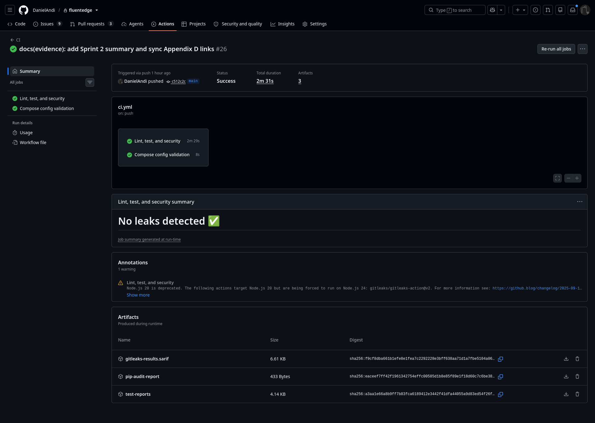
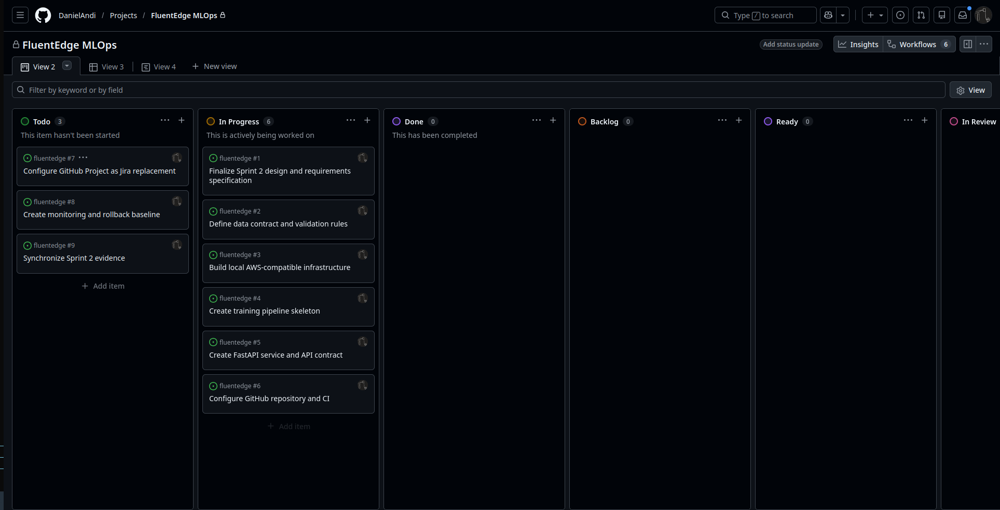
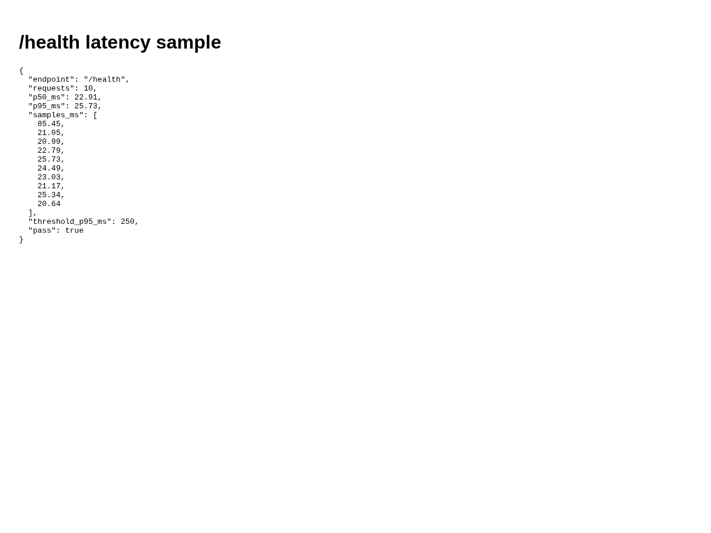
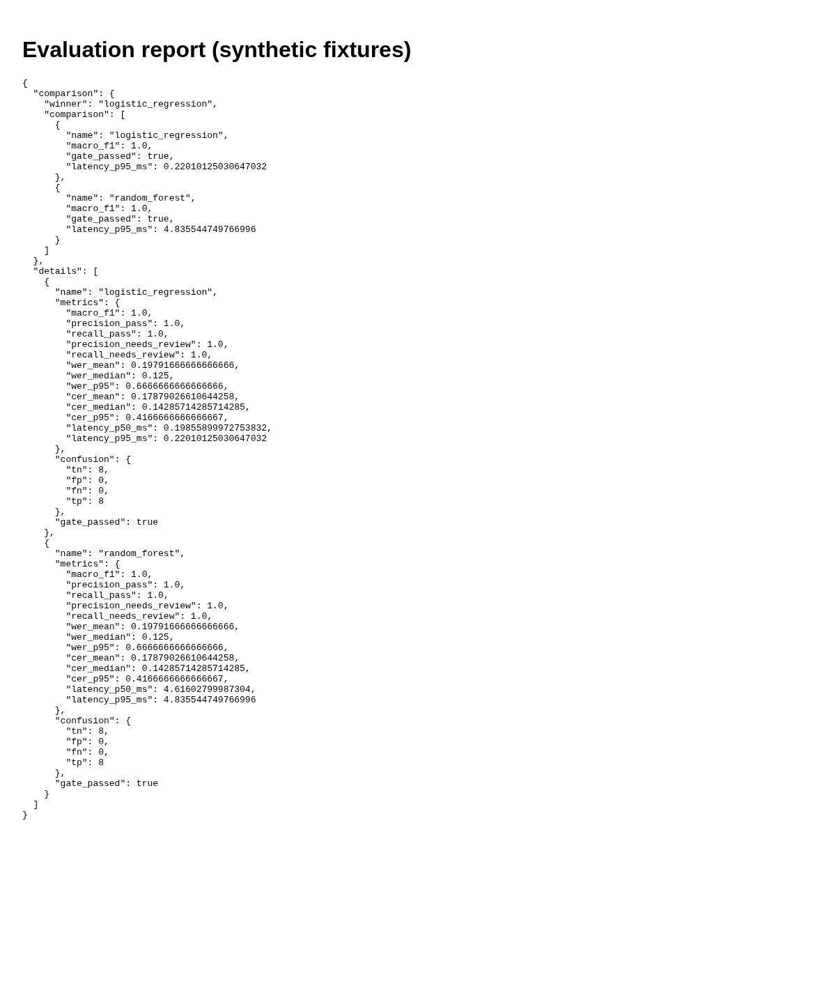
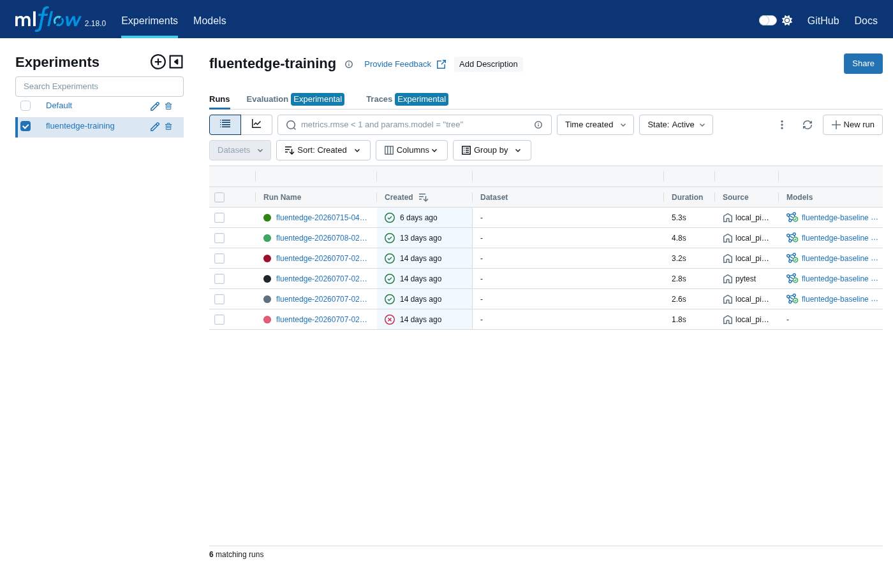
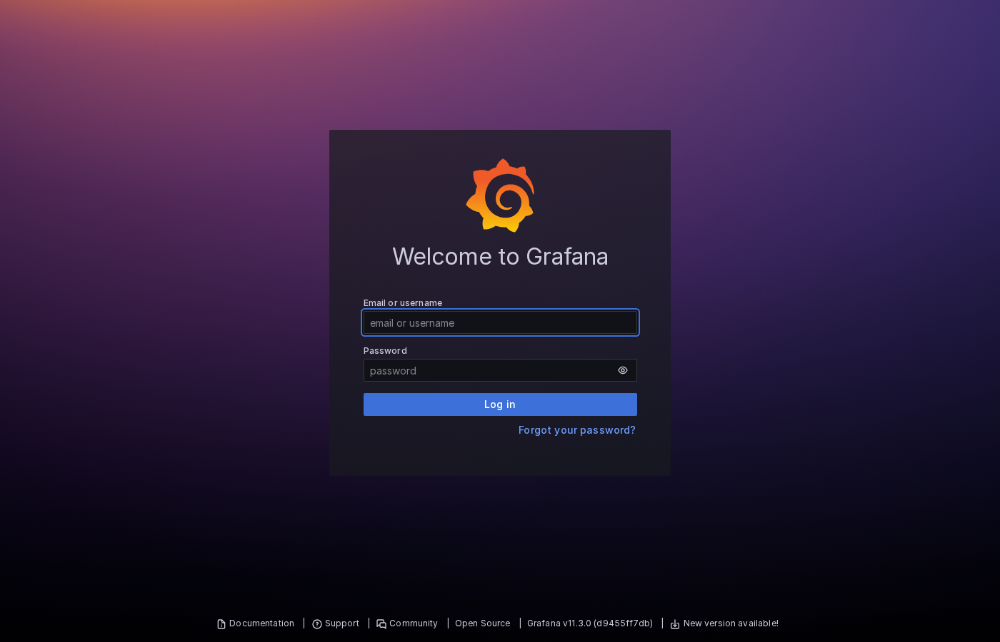
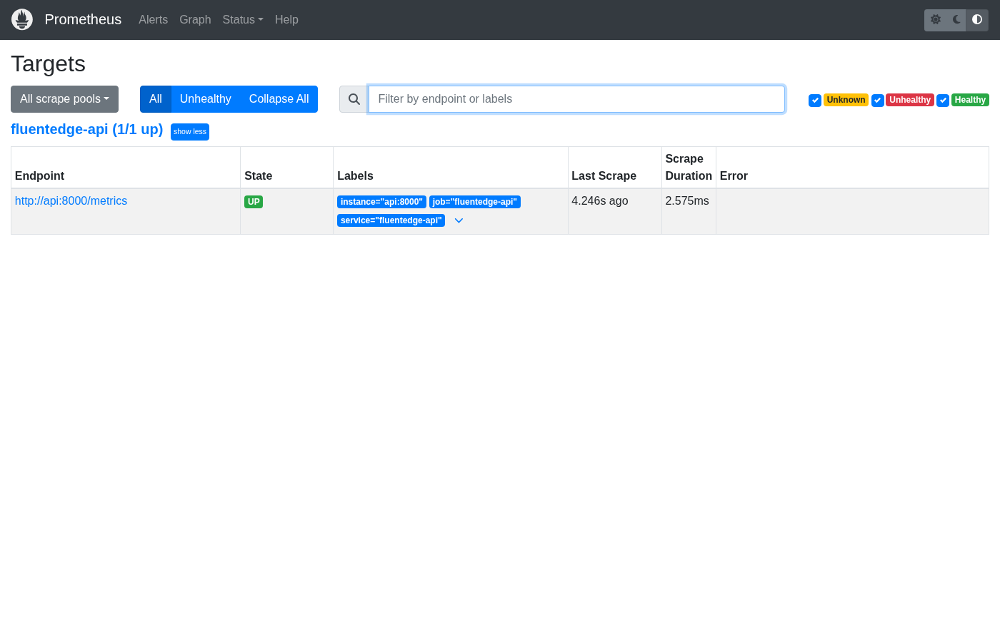
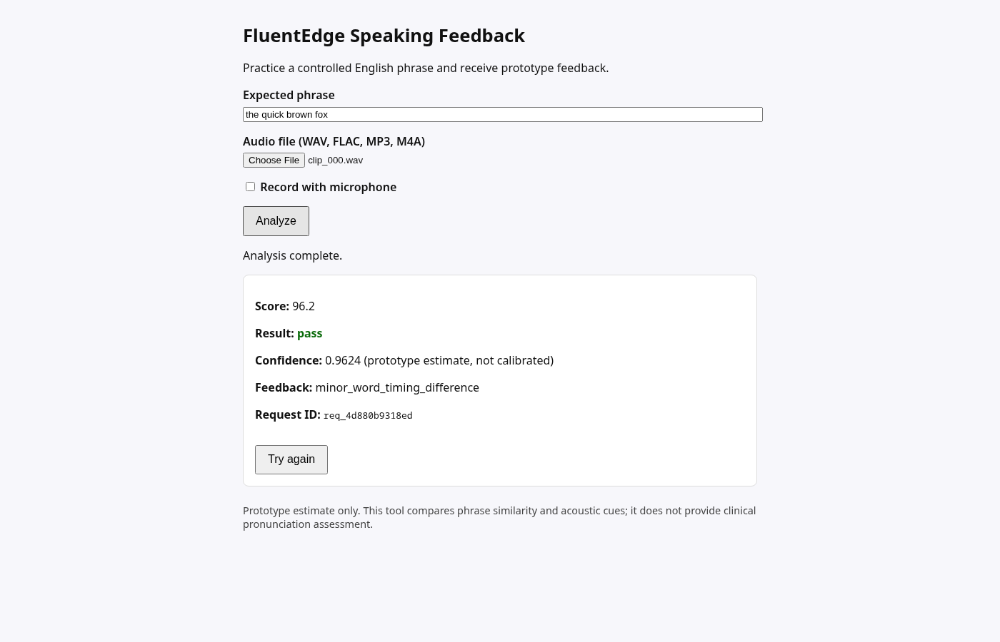
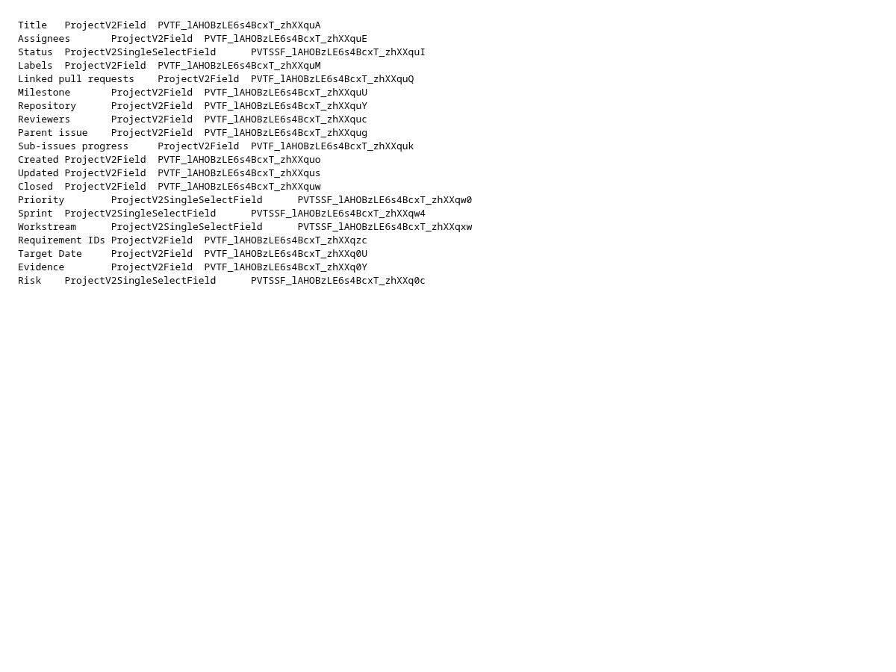
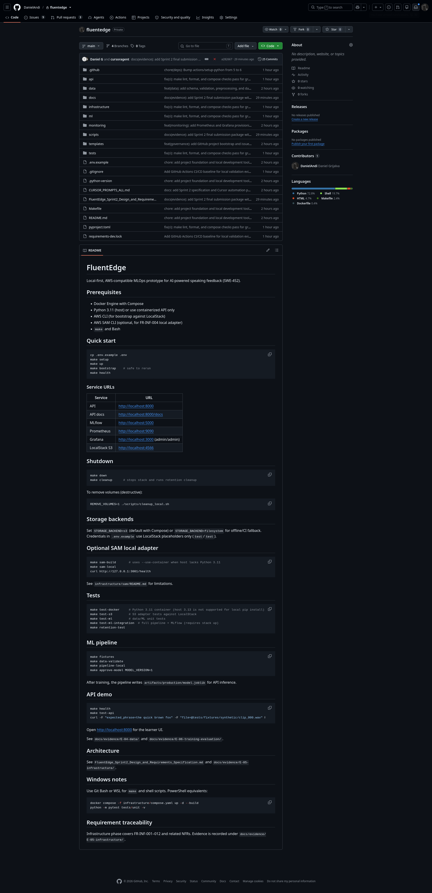

# FluentEdge Sprint 2 — Final Evidence Submission

**Course:** SWE-452  
**Project:** FluentEdge local-first MLOps speaking-feedback prototype  
**Author:** Daniel Grijalva  
**Submission date:** 2026-07-08  
**Repository:** https://github.com/DanielAndi/fluentedge  
**Evidence commit baseline:** `a282667`; local screenshots refreshed from the running stack during evidence audit

---

## 1. Submission summary

This document consolidates Sprint 2 implementation evidence for FluentEdge: a local Docker Compose stack with FastAPI inference, MLflow model registry, LocalStack-compatible storage, Prometheus/Grafana monitoring, GitHub Issues/Projects governance, and GitHub Actions CI/CD. All evidence paths are repository-relative unless noted as external GitHub URLs.

| Area | Status | Primary evidence |
|------|--------|----------------|
| E-01 Architecture | Complete | Mermaid diagrams in design specification |
| E-02 Requirements | Complete | Project backlog/table + board screenshots |
| E-03 Non-functional | Complete | CI run + latency report |
| E-04 Data | Complete | Schema, dataset card, validation |
| E-05 Infrastructure | Complete | Compose, SAM, health checks |
| E-06 Training | Complete | Pipeline artifacts + MLflow |
| E-07 Deployment / monitoring | Complete | CI/CD, Grafana, Prometheus |
| E-08 UI / API | Complete | Learner UI + OpenAPI + sample response |
| E-09 Governance | Complete | Audit report, Project board, fields export, repository overview |
| E-10 Final review | Complete | This document + traceability evidence-index screenshot |

**Confluence waiver:** Sprint 2 evidence is maintained in GitHub (`docs/evidence/`) per instructor-approved Jira replacement guidance. Attach written Confluence waiver if the syllabus requires it.

---

## 2. Repository and governance

| Item | Link |
|------|------|
| Repository | https://github.com/DanielAndi/fluentedge |
| GitHub Project #4 | https://github.com/users/DanielAndi/projects/4 |
| Sprint 2 milestone | https://github.com/DanielAndi/fluentedge/milestone/1 |
| Design specification | [`FluentEdge_Sprint2_Design_and_Requirements_Specification.md`](../../../FluentEdge_Sprint2_Design_and_Requirements_Specification.md) |
| Evidence index (Appendix D) | Same specification, Appendix D |
| Governance audit | [`../E-09-github-governance/github-audit.md`](../E-09-github-governance/github-audit.md) |

### Sprint 2 issues

| # | Title | URL |
|---|-------|-----|
| 1 | Finalize Sprint 2 design and requirements specification | https://github.com/DanielAndi/fluentedge/issues/1 |
| 2 | Define data contract and validation rules | https://github.com/DanielAndi/fluentedge/issues/2 |
| 3 | Build local AWS-compatible infrastructure | https://github.com/DanielAndi/fluentedge/issues/3 |
| 4 | Create training pipeline skeleton | https://github.com/DanielAndi/fluentedge/issues/4 |
| 5 | Create FastAPI service and API contract | https://github.com/DanielAndi/fluentedge/issues/5 |
| 6 | Configure GitHub repository and CI | https://github.com/DanielAndi/fluentedge/issues/6 |
| 7 | Configure GitHub Project as Jira replacement | https://github.com/DanielAndi/fluentedge/issues/7 |
| 8 | Create monitoring and rollback baseline | https://github.com/DanielAndi/fluentedge/issues/8 |
| 9 | Synchronize Sprint 2 evidence | https://github.com/DanielAndi/fluentedge/issues/9 |

---

## 3. Automated verification (2026-07-08)

| Check | Result | Evidence |
|-------|--------|----------|
| `pytest tests/unit -m "not integration"` | 41 passed, 2 skipped | [CI run](https://github.com/DanielAndi/fluentedge/actions/runs/28911390804) |
| `ruff format --check` / `ruff check` | pass | same CI run |
| `docker compose config` | pass | same CI run |
| Container build + `/health` smoke | pass | [Container run](https://github.com/DanielAndi/fluentedge/actions/runs/28910958927) |
| Gitleaks secret scan | pass | CI run |
| `pip-audit` | warn (mlflow/pyarrow advisories) | non-blocking |
| Local health check (`make health`) | 6/6 pass | [`../E-05-infrastructure/health-check-output.txt`](../E-05-infrastructure/health-check-output.txt) |
| `/health` p95 latency (10 samples) | 25.73 ms (< 250 ms threshold) | [`../E-03-non-functional/performance-report.json`](../E-03-non-functional/performance-report.json) |



---

## 4. Evidence by area

### E-01 — Architecture

Architecture evidence is maintained as Mermaid source in the design specification:

| Diagram | Source |
|---------|--------|
| Local runtime architecture | `FluentEdge_Sprint2_Design_and_Requirements_Specification.md`, §2.4 |
| AWS target architecture | `FluentEdge_Sprint2_Design_and_Requirements_Specification.md`, §2.5 |
| Data and artifact lineage | `FluentEdge_Sprint2_Design_and_Requirements_Specification.md`, §5.7 |
| Prediction request sequence | `FluentEdge_Sprint2_Design_and_Requirements_Specification.md`, §6.2.1 |

See [`../E-01-architecture/README.md`](../E-01-architecture/README.md).

---

### E-02 — Requirements review




---

### E-03 — Non-functional verification



Security: [CI run artifacts](https://github.com/DanielAndi/fluentedge/actions/runs/28911390804) (gitleaks + pip-audit).

---

### E-04 — Data

| Artifact | Path |
|----------|------|
| Dataset card | [`../../data/dataset_card.md`](../../data/dataset_card.md) |
| Schema | `ml/data/schema.py` |
| Validation summary | [`../E-04-data/validation-summary.md`](../E-04-data/validation-summary.md) |
| Evaluation report | [`../E-04-data/validation-report.json`](../E-04-data/validation-report.json) |



Synthetic fixtures only (48 clips). See [`../E-04-data/README.md`](../E-04-data/README.md).

---

### E-05 — Infrastructure

| Artifact | Path |
|----------|------|
| Compose | `infrastructure/compose.yaml` |
| SAM template | `infrastructure/sam/template.yaml` |
| Health script | `scripts/healthcheck.sh` |


---

### E-06 — Training and evaluation

| Artifact | Path |
|----------|------|
| Pipeline evidence | [`../E-06-training-evaluation/README.md`](../E-06-training-evaluation/README.md) |
| Model card (local run) | `artifacts/runs/467fb3aa/model_card.md` |
| Metrics | `artifacts/runs/467fb3aa/evaluation_report.json` |



**Metric disclaimer:** Macro F1 on synthetic fixtures demonstrates pipeline wiring, not clinical pronunciation accuracy.

---

### E-07 — Deployment and monitoring

| Artifact | Path |
|----------|------|
| CI/CD evidence | [`../E-07-deployment-monitoring/ci-cd.md`](../E-07-deployment-monitoring/ci-cd.md) |
| Rollback baseline | [`../E-07-deployment-monitoring/rollback-test.md`](../E-07-deployment-monitoring/rollback-test.md) |





---

### E-08 — UI and API

| Artifact | Path |
|----------|------|
| OpenAPI | [`../E-08-ui-api/openapi.json`](../E-08-ui-api/openapi.json) |
| Sample response | [`../E-08-ui-api/sample_response.json`](../E-08-ui-api/sample_response.json) |
| API tests | `tests/unit/test_predict.py` |



Live capture (2026-07-08): label `pass`, confidence ~0.96, phrase `the quick brown fox`.

---

### E-09 — GitHub governance






Full audit: [`../E-09-github-governance/github-audit.md`](../E-09-github-governance/github-audit.md)

**Note:** Saved Project views (Roadmap, Evidence Review) should still be confirmed in the GitHub web UI per [`../../project-management/github-project-setup.md`](../../project-management/github-project-setup.md).

---

### E-10 — Final traceability


Supporting summary: [`../SPRINT2_EVIDENCE_SUMMARY.md`](../SPRINT2_EVIDENCE_SUMMARY.md)

---

## 5. Requirements coverage (abbreviated)

| IDs | Implementation | Verification |
|-----|----------------|--------------|
| FR-DI-001–007 | `ml/data`, `ml/features` | `test_validate.py`, validation report |
| FR-ML-001–008 | `ml/pipeline`, MLflow registry | pipeline run, model card |
| FR-INF-001–012 | Compose, SAM, storage adapters | health check, CI compose job |
| FR-API-001–007 | `api/app`, static UI | `test_predict.py`, live `/predict` |
| FR-PM-001–009 | Issues, Project #4, bootstrap scripts | `github-audit.md` |
| NFR-PERF-001–002 | API latency | performance report |
| NFR-OBS-001–002 | Prometheus + Grafana | dashboard screenshots |
| NFR-REL-002 | MLflow production v1 | rollback-test.md |
| NFR-SEC-001–003 | CI gitleaks + pip-audit | Actions run |
| NFR-MAINT-001 | ruff + pytest in CI | Actions run |

Full matrix: design specification Appendix A.

---

## 6. Known limitations

1. **Synthetic data only** — no private student recordings; metrics are functional, not accuracy claims.
2. **MLflow advisories** — `pip-audit` reports known CVEs for pinned `mlflow==2.18.0`; upgrade deferred.
3. **GitHub Project views** — CLI/bootstrap complete; some saved views may still need manual web configuration.
4. **Branch protection** — documented in `docs/project-management/branch-protection.md`; screenshot optional if not enabled on account plan.
5. **Issues remain open** — evidence is linked; formal closure awaits instructor review of acceptance criteria.

---

## 7. Export to PDF

From repository root:

```bash
# Requires pandoc (optional)
pandoc docs/evidence/E-10-final-review/SPRINT2_FINAL_SUBMISSION.md \
  FluentEdge_Sprint2_Design_and_Requirements_Specification.md \
  -o FluentEdge_Sprint2_Submission.pdf
```

Or export this Markdown file and the design specification separately from your editor.

---

## 8. Reproducing evidence captures

```bash
make up
make health
python scripts/capture_evidence_screenshots.py   # UI, MLflow, Grafana, Prometheus
```

See [`../MANUAL_SCREENSHOT_CHECKLIST.md`](../MANUAL_SCREENSHOT_CHECKLIST.md) for the full checklist.
